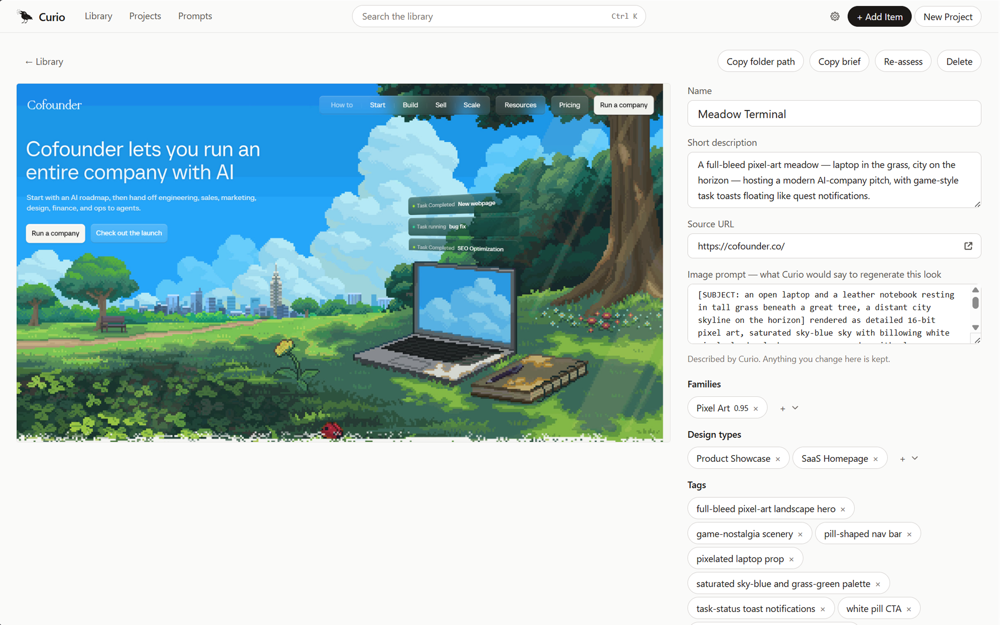
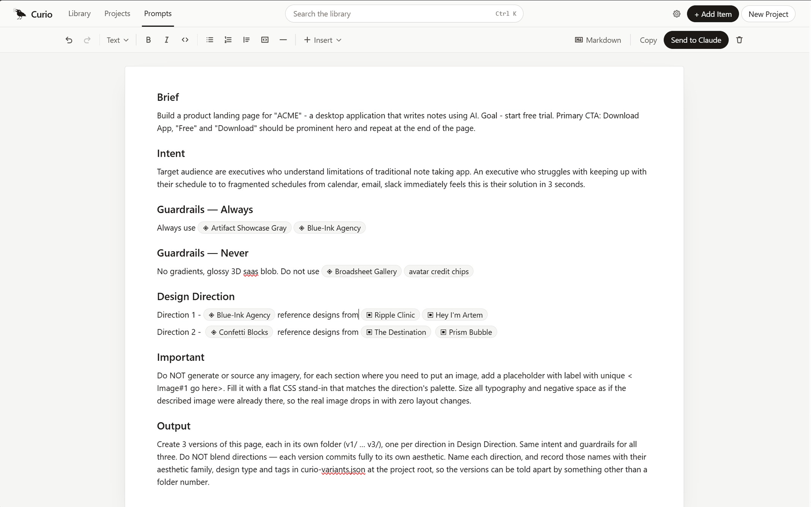

<div align="center">

<h1>&nbsp;Curio</h1>

**Your own Pinterest-style inspiration board — running on your computer, not someone's cloud.**

[](https://github.com/rescueahero4/Curio)
[](LICENSE)
[](#setup)

</div>

| | | |
|:--:|:--:|:--:|
|  |  |  |
| Your library | Described automatically | Turned into prompts |

## What you can do

- 📌 **Build a design library that's actually yours.** Images, screenshots, references — saved to a folder on your own machine.
- 🧩 **Clip any website in one click.** The browser extension grabs what you're looking at and files it away.
- 🤖 **Let AI do the tagging.** Add your Anthropic API key and Curio looks at everything you save, then describes and organizes it in your own vocabulary.
- 🔌 **Feed it to your AI tools.** A built-in MCP server and prompt builder plug your library straight into Claude, Cursor, or any agent you use to design.

> **Nothing leaves your machine.** No telemetry, no analytics, no accounts, no phone-home. The only network calls Curio ever makes are the AI ones you trigger with your own key — and that key lives in your OS keychain, never in a file in this repo.

<div align="center">

**⭐ Leave me a star if you find this usedul **

</div>

---

## Contents

- [Setup](#setup) — get it running, ~5 minutes
- [Things to know](#things-to-know) — checking your build, how the code is laid out, making it yours
- [Reference](#reference) — file locations, settings, troubleshooting

---

# Setup

Prebuilt installers for Windows and macOS arrive with the first tagged release. Until then you run it from source, which is four steps.

> **Heads up on the first build:** it downloads the Rust toolchain and compiles everything from scratch — several minutes and roughly 1–2 GB, once. Every run after that takes seconds.

## Step 1 — Install Rust and Node

You need two things. Check whether you already have them:

```sh
rustc --version    # want 1.95 or newer
node --version     # want v20 or newer
```

If either says `command not found`, install it below.

<details>
<summary><b>macOS instructions</b></summary>

```sh
xcode-select --install                                            # compiler tools
curl --proto '=https' --tlsv1.2 -sSf https://sh.rustup.rs | sh    # Rust — choose option 1
source "$HOME/.cargo/env"
```

Then grab the macOS installer for [Node 20+](https://nodejs.org).

</details>

<details>
<summary><b>Windows instructions</b></summary>

1. Download and run `rustup-init.exe` from [rustup.rs](https://rustup.rs).
2. When it offers to install the **Visual Studio C++ build tools**, say yes. Rust cannot build without them.
3. Download and run the Windows installer for [Node 20+](https://nodejs.org).

</details>

**Then close your terminal, open a new one, and run both `--version` commands again.** Both must print a version. If `rustc` still isn't found, it's the old terminal — open a fresh window rather than reusing one.

## Step 2 — Get the code

```sh
git clone https://github.com/rescueahero4/Curio.git
cd Curio
npm --prefix web/spa install
```

## Step 3 — Build the dashboard

```sh
npm --prefix web/spa run build
```

<details>
<summary>Why this step exists</summary>

Curio serves its own interface from inside the app. If the dashboard hasn't been built, the app starts up and serves a blank page. Do this once before the first run.

</details>

## Step 4 — Run it

```sh
cargo run --bin curio
```

That's it. A tray icon appears and your browser opens on the dashboard.

<details>
<summary>Things you'll notice on the first run</summary>

- **`--bin curio` isn't optional.** This project builds two programs, so a bare `cargo run` doesn't know which you meant and stops with `could not determine which binary to run`.
- **A black console window opens.** That's the log output, and it's intentional in a development build. A real release build shows no console. Want to see it? `cargo build --release --bin curio`, then run `target/release/curio.exe` (macOS: `target/release/curio`) directly.
- **To quit properly**, use the tray icon's Quit item. It shuts everything down in the right order and cleans up.
- **`reclaiming a stale runtime.json from a previous run`** in the log means the last session was killed rather than quit. It fixes itself and is safe to ignore.
- **Working on the interface?** Run `npm --prefix web/spa run build -- --watch` in a second terminal. Save, refresh the browser, done — no Rust rebuild needed.

</details>

---

## Optional add-ons

Each of these is independent. Do them in any order, or skip them.

### 🤖 Let AI describe your library

Without a key, everything you save still lands and stays browsable — it just sits marked "Queued — needs an API key," and the queue drains itself the moment you add one.

Open **Settings → API key** in the dashboard and paste in an [Anthropic API key](https://console.anthropic.com). It goes into your OS keychain (DPAPI on Windows, Keychain on macOS) — never into the database, a config file, or a log.

<details>
<summary>Prefer an environment variable?</summary>

```sh
export ANTHROPIC_API_KEY=sk-ant-...       # macOS
$env:ANTHROPIC_API_KEY = "sk-ant-..."     # Windows PowerShell
```

</details>

### 🧩 Clip websites with the browser extension

Needs Chrome, Edge, or Brave 116+.

```sh
npm --prefix web/extension install
npm --prefix web/extension run build
cargo run --bin curio-nmh -- --register
```

Then in Chrome: **`chrome://extensions`** → turn on **Developer mode** → **Load unpacked** → pick the `web/extension/dist` folder.

There's no pairing step and no token to copy — the extension finds Curio by itself. Click its toolbar icon and you should see a green dot and "Curio is running."

<details>
<summary>Removing it later</summary>

```sh
cargo run --bin curio-nmh -- --unregister
```

</details>

### 🔌 Connect your AI agents (MCP)

Off by default. Turn it on in **Settings → MCP**, then point your agent at it. For Claude Code it's one line:

```sh
claude mcp add --scope user curio -- <path-to-curio> --mcp-stdio
```

**Copy the real line from Settings → MCP rather than typing this one.** Settings fills in the actual path to your executable, which is the part that makes it work — a bare `curio` resolves for nobody, and the registration will be accepted and then fail on every connection. Re-copy it if you move or reinstall Curio.

<details>
<summary>The two transports underneath, for other clients</summary>

- **stdio** — `curio --mcp-stdio`. It forwards to the running app rather than opening the database itself, so Curio must already be running. It re-reads `runtime.json` per frame, which is why it survives restarts on an ephemeral port. Claude Desktop uses this one, as JSON in `claude_desktop_config.json`; Settings shows the snippet.
- **HTTP** — `http://127.0.0.1:<port>/mcp`. The port is in `runtime.json` and Settings shows the command. Curio takes a new port each run unless you pin one in `config.json`, so a registration made this way goes stale at the next restart.

</details>

---

# Things to know

## Check your build

One command tells you whether everything is healthy:

```sh
cargo gate
```

Eight steps, cheapest first: formatting → linting → Rust tests → dashboard typecheck/lint/build → extension typecheck/build → licences and security advisories → file length → dependency direction. **This is exactly what CI runs.** If it passes on your machine, it passes there.

```sh
cargo gate -- --rust-only     # skip the two npm builds
cargo gate -- --web-only      # only the dashboard and the extension
```

<details>
<summary>Running narrower tests while you work</summary>

```sh
cargo test --workspace                                   # everything
cargo test -p curio-core                                 # domain rules: thresholds, prompts, retry policy
cargo test -p curio-db                                   # storage, migrations, search, sidecars
cargo test -p curio-server                               # routes, middleware, worker, images
cargo test -p curio-server --test assessment_pipeline    # capture → assessed, against a stub API
```

Run `assessment_pipeline` whenever you touch the AI path. It boots the whole service against a stubbed Anthropic API and asserts a capture reaches `ready` with tags, a family and a sidecar — plus that the request Curio *built* had the right shape.

Frontend only:

```sh
npm --prefix web/spa run gate            # typecheck + lint + build
npm --prefix web/extension run gate
npm --prefix web/spa run format          # auto-fix lint and formatting
```

Some things a test can't do — spend a real API key, click a browser toolbar button, use the tray menu. For those, follow [the manual test guide](docs/tests/manual-e2e-test-guide.md), written to need no technical background.

</details>

## How the code is organized

One small program — tray icon, a local web server, and a SQLite database — plus a dashboard and a browser extension.

```
curio (single binary)
  tray (main thread) ──▶ service thread
                          ├─ /api + SSE      → the dashboard
                          ├─ /ws             → the extension
                          ├─ /mcp            → AI agents
                          └─ SQLite (WAL)    → the library
```

**One process. One database file. One origin. One token.** `library.db` in your data folder is the entire backup story.

| Folder | What's in it |
|---|---|
| `crates/curio-core` | The rules of the product. No database, no networking. |
| `crates/curio-db` | The only place that touches SQL. |
| `crates/curio-server` | The web server, background worker, and AI calls. |
| `crates/curio-mcp` | The agent-facing tools. |
| `crates/curio-tray` | The tray icon and app startup. Builds the `curio` program. |
| `web/spa` | The dashboard — SolidJS + Vite + Tailwind. |
| `web/extension` | The Chrome extension — plain TypeScript. |
| `docs/architecture` | The contract this code implements. Read this before changing anything structural. |

<details>
<summary>The rest of the tree</summary>

| Folder | What's in it |
|---|---|
| `crates/curio-nmh` | Tiny helper that lets the browser find the app. |
| `crates/curio-runtime` | Shared shape of `runtime.json`. |
| `crates/xtask` | The gate script and measurement tooling. |
| `web/site` | The public landing page (Astro). Never ships inside the app. |
| `packaging/` | macOS `.app`, Windows installer, MCP bundle. |
| `docs/tests` | Manual test guides. |

</details>

## Make it your own

Curio is MIT licensed — fork it, rename it, rip parts out, sell it. No permission needed.

Good places to start:

- **Change how things look** — everything visual lives in `web/spa`. Build, refresh, done; no Rust knowledge required.
- **Change what the AI says about your images** — the prompts live in `crates/curio-core`.
- **Add your own agent tools** — `crates/curio-mcp` defines what AI agents can see and do.

Before a structural change, read [ARCH-00 Architecture Overview](docs/architecture/00-architecture-overview.md) — it maps every part of the system to the document that governs it. For what the product is *for*, read [the PRD](docs/PRD-01-Foundations.md). To contribute back, see [CONTRIBUTING.md](CONTRIBUTING.md).

---

# Reference

<details>
<summary><b>Where your files live</b></summary>

| What | Windows | macOS |
|---|---|---|
| Your library (`library.db`, `items/`, `prompts/`, `skills/`) | `%USERPROFILE%\Curio` | `~/Curio` |
| `runtime.json` — port and per-run token | `%LOCALAPPDATA%\Curio` | `~/Library/Application Support/Curio` |
| `curio.lock` — quit token | `%LOCALAPPDATA%\Curio` | `~/Library/Application Support/Curio` |

`runtime.json` is deleted when Curio quits. Its absence is how everything else knows the app isn't running.

</details>

<details>
<summary><b>Environment variables</b></summary>

| Variable | Effect |
|---|---|
| `ANTHROPIC_API_KEY` | The model key. Overrides the keychain. |
| `CURIO_DATA_ROOT` | Use a different library folder — handy for testing against a scratch library. |
| `CURIO_PORT` | Pin the port instead of using an ephemeral one. |
| `CURIO_NO_OPEN=1` | Don't open the browser at boot; same as `--no-open`. |
| `RUST_LOG` | Log level, e.g. `RUST_LOG=debug`. Logs go to stderr. |

</details>

<details>
<summary><b>When installers arrive, your browser will warn you about them</b></summary>

The builds are **not signed with a paid certificate**, so Windows SmartScreen and macOS Gatekeeper flag them. That's what an unsigned build looks like — not a sign something is wrong with the file. There's no free way around it on macOS, where Apple gates signing behind a $99/year membership with no open-source exemption.

- **Windows** — "Windows protected your PC" → **More info** → **Run anyway**.
- **macOS** — **System Settings → Privacy & Security**, scroll to the message about Curio, **Open Anyway**.

If you'd rather not take our word for it, everything here builds from source in four steps — that path is above, and it's the same one CI runs.

</details>

<details>
<summary><b>Project status</b></summary>

E0–E9 complete, E10 (packaging) in progress. The app runs, captures, assesses, and answers MCP. The release pipeline that builds the installers exists but hasn't cut a tag yet, which is why running from source is the path today.

Epic-by-epic status lives in [the PRD](docs/PRD-01-Foundations.md); what lands when is in the [phase plan](docs/architecture/07-delivery-open-source.md).

</details>

<details>
<summary><b>Where the documentation lives</b></summary>

Everything is in `docs/` and read on GitHub — the landing page at [rescueahero4.github.io/Curio](https://rescueahero4.github.io/Curio/) publishes none of it, so this tree is the only copy.

The architecture documents are **contract-level**: they state interfaces, invariants and budgets, and the code must conform to their numbered rules. Start at [ARCH-00 Architecture Overview](docs/architecture/00-architecture-overview.md), which maps every domain to its owning document, then read the one covering whatever you're changing.

</details>

---

<div align="center">

**Found this useful? [⭐ Star it](https://github.com/rescueahero4/Curio) or share it with someone who hoards screenshots.**

MIT licensed — see [LICENSE](LICENSE).

</div>
