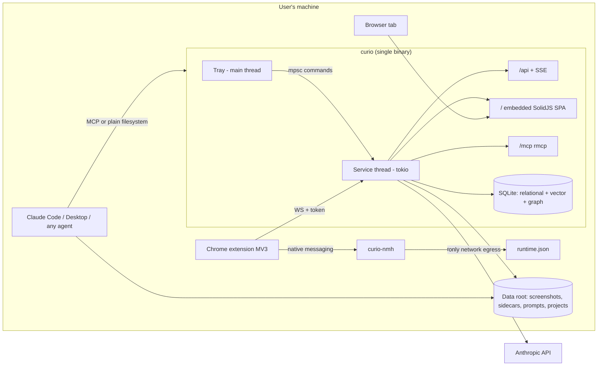

# Architecture Overview

> **TL;DR:** Curio is being rebuilt as **one small Rust binary** (tray app + local server + SQLite) with a **SolidJS** web UI and a Chrome extension. Everything runs on your machine; the browser is the screen, the tray is the switch, one database file is the memory. This document is the map: it tells you which document owns which part, and records every decision that shapes the whole system.

## At a glance

- **What Curio does** is unchanged: capture design references, let AI describe and organize them, compose design prompts from that vocabulary, and catalog the projects your AI tools produce. The product requirements (PRD FR-1..FR-27) still govern *what*; these documents govern *how*.
- **One process**: tray owns the main thread, a tokio service thread owns everything else, connected by a command channel ([ARCH-01](01-backend-architecture.md)).
- **One database file**: relational tables + vector index + graph edges in the same SQLite file ([ARCH-02](02-data-architecture.md)).
- **One origin**: the app serves its own UI at `http://127.0.0.1:<ephemeral port>` — no CORS, no bundled webview ([ARCH-03](03-frontend-architecture.md)).
- **One token**: a per-run bearer token in `runtime.json`, handed to the extension by a native-messaging micro-binary and to the SPA by a one-time nonce ([ARCH-06](06-security-architecture.md)).

## Document map

| Doc | Owns | Read it for |
|---|---|---|
| [ARCH-00](00-architecture-overview.md) (this) | System context, decision register, glossary | Where everything lives; why the big calls were made |
| [ARCH-01](01-backend-architecture.md) | Process model, HTTP/SSE contracts, jobs, watcher, AI layer, config, crates, budgets | Everything inside the binary |
| [ARCH-02](02-data-architecture.md) | Data root, SQLite schema (relational + vec + graph), migrations, sidecars, IDs | Everything that persists |
| [ARCH-03](03-frontend-architecture.md) | SolidJS SPA: routes, state, editor, UX contracts | Everything in the browser tab |
| [ARCH-04](04-extension-architecture.md) | MV3 extension + native-messaging host | Capture and pairing |
| [ARCH-05](05-mcp-architecture.md) | MCP tools, transports, gating, MCPB | How agents talk to Curio |
| [ARCH-06](06-security-architecture.md) | Threat model, tokens, nonce, Host/Origin, jails, secrets | Why it's safe on localhost |
| [ARCH-07](07-delivery-open-source.md) | Repo layout, CI, packaging, licensing, community | How it builds, ships, and takes contributions |
| [ARCH-08](08-parity-matrix.md) | FR ↔ doc ↔ rule mapping; deliberate parity breaks | Proof nothing was dropped, and what changed on purpose |

Reading order for a new contributor: ARCH-00 → the PRD → ARCH-01 → whichever domain doc your change touches → ARCH-08 to check the invariants you now own.

## The contract

- **R-OV-1** These documents are **contract-level**: they state interfaces, invariants, budgets, and decisions — not implementations. Code MUST conform to numbered rules; rules change only by PR that updates the doc (and its `version`/`supersedes` frontmatter). See [ARCH-07](07-delivery-open-source.md) for the process.
- **R-OV-2** One fact, one home. A rule lives in exactly one document; everything else links to it. If two docs appear to state the same rule, the one whose `governs` domain matches wins and the other is a defect.
- **R-OV-3** The **PRD remains the product authority** (what Curio does); this set is the technical authority (how). Where this set deliberately breaks with the *old implementation*, the break is recorded in [ARCH-08](08-parity-matrix.md) §Deliberate breaks — silent divergence is a defect.
- **R-OV-4** Anything marked **D0-verify** in any doc MUST be verified in the Phase D0 spike before code depends on it (strategy §9). D0 items are indexed in [ARCH-07](07-delivery-open-source.md).

## Decision register

Decisions D1–D6 restate the strategy document's register (A1–A6) unchanged; D7 onward are new, made for this rewrite. "Reversal trigger" = the observable condition under which the decision should be revisited, per the Paper's discipline.

| ID | Decision | Rationale | Reversal trigger |
|---|---|---|---|
| D1 (=A1) | Single process; tray on main thread; tokio current-thread worker; mpsc seam | Halves lifecycle surface; macOS/Windows UI-thread rules force this shape | Need for service with zero UI session |
| D2 (=A2) | Off = soft-disable (503 + Retry-After), never unbind/exit | Clean errors for MCP/extension; instant resume | — |
| D3 (=A3) | One SQLite file: relational + `sqlite-vec` + edge tables | One writer, one backup artifact, hybrid queries in one statement | >10⁶–10⁷ vectors or unbounded graph queries |
| D4 (=A4) | No bundled webview; the user's browser is the UI | Footprint; Paper §13 stands | Requirement for offline-of-browser UI |
| D5 (=A5) | Nonce-based dashboard launch from tray | Token never enters URL/history | — |
| D6 (=A6) | `curio-nmh` as a separate micro-binary | Chrome spawn latency; stdout purity | — |
| D7 | Vector + graph are **designed in, activated post-v1** (owner, 2026-07-31; reverses the 2026-07-30 v1-active decision). Schema seams and crate seams per ARCH-02 remain; no embeddings, vec table, graph tables, or semantic tools ship in v1. | Owner narrowed v1 scope back to parity; keeping the design documented makes activation a migration, not a redesign | Owner re-activates for v1; at the activation release, sqlite-vec failing its D0 verification falls back per D8 |
| D8 | (post-v1) Vector engine: `sqlite-vec`, pinned at D0; **fallback order**: SQLite `Vec1` (official-adjacent ANN extension, v0.7 as of mid-2026) → FTS5-only with vectors deferred | In-database vector, no second engine (D3); two credible implementations reduce single-crate risk | D0 spike results |
| D9 | (post-v1) Embeddings via an **embedder trait**; v1 default = remote embeddings API with user-supplied key, stored like the Anthropic key; local-model embedder is a later `impl`, never a v1 link-time dependency | Daemon must not link an ML runtime (strategy §5.2); trait keeps both futures open | A vetted, small local embedder becomes table stakes |
| D10 | **Ephemeral port + `runtime.json` + native-messaging bootstrap** replaces fixed ports 4321–4331, port-walking, and manual pairing (owner, 2026-07-30) | Kills port-conflict class entirely; token never crosses a web-observable channel | — |
| D11 | `config.json` keeps an **optional `port` override** (default absent = ephemeral; `CURIO_PORT` env wins over config, legacy `CURIOL_PORT` honored when it's unset). The `/pair` page survives as the **sanctioned fallback pairing path** for unpacked/dev installs: it hands off the current **runtime token** via the click-gated DOM element, backed by a re-instated `POST /api/pair/authorize` | Ephemeral is right by default; development and unpacked extensions need a deterministic address and a token path that doesn't require NM registration | — |
| D12 | Auth broadens: **every `/api/*` and `/mcp` request requires the bearer token** (old app authenticated only ingest/quit). SPA obtains it via nonce exchange; `/health`, `/` and static assets stay tokenless | Paper §4.4; the old posture predates the threat model | — |
| D13 | Push transports: **SPA uses SSE** (`/api/events`, parity contract); **extension uses WebSocket** `/ws` with 20 s keepalive (new, per strategy). Both are served; neither replaces the other | SSE contract is proven in the old app; WS solves the MV3 worker-lifetime problem | — |
| D14 | Tray menu = strategy's five items (Status · Pause/Resume · Open Dashboard · Start at Login · Quit). The old shell's Open Projects / New Prompt entries are dropped; navigation lives in the SPA | Tray is a switch, not a nav bar; FR-23 requires only Open and Quit | Owner asks for shortcuts back |
| D15 | MCP surface = **7 parity tools in v1**; the 2 semantic tools (`library_semantic_search`, `library_related_items`) ship with the vector layer post-v1 — withheld-not-erroring semantics per [ARCH-05](05-mcp-architecture.md) apply at that release | Parity preserved exactly; the semantic pair follows D7's activation | — |
| D16 | Editor: **TipTap headless core** (framework-agnostic) driven from SolidJS; serialization stays server-side and authoritative | Keeps ProseMirror's model + the old app's chip/serializer semantics portable | TipTap core proves React-entangled at D0 |
| D17 | Resource budget: strategy §8 numbers are **binding** (idle RSS ≤ 25 MB, empty shell ≤ 12 MB at D0); PRD §11's ≤ 200 MB is superseded as trivially loose | Tighter number wins; it's the point of the rewrite | D0/P7 measurement forces conscious revision |
| D18 | License: **MIT** (owner: "any permissive OSS") | Maximally frictionless for a dev/design tool; recorded in [ARCH-07](07-delivery-open-source.md) | — |
| D19 | Crate naming `curio-*` (`curio-core`, `curio-db`, `curio-server`, `curio-mcp`, `curio-tray`, `curio-nmh`); repo layout per [ARCH-07](07-delivery-open-source.md) | Strategy's `app-*` placeholders concretized | — |
| D20 | The Rust app **adopts the existing data root and database lineage**: same `~/Curio` layout, same tables, migrations continue from the shipped chain (see [ARCH-02](02-data-architecture.md)) | Real users have real libraries; parity includes their data, not just features | — |
| D21 | Token lifetime is **per-run**: minted at each service start, invalidated at quit. Clients MUST treat 401 as "the app restarted" and re-bootstrap (extension: re-run NM handshake once, then surface; SPA: show the reconnect screen) | Narrower than the Paper's per-install token; restart-recovery is cheap for every client | A client class appears that cannot re-bootstrap unattended |
| D22 | SPA session: the one-time nonce exchange sets an **HttpOnly, SameSite=Strict, session-scoped cookie**; all `/api/*` including SSE authenticate by that cookie (bearer header equally accepted for non-browser clients). Reload survives; a visit with no session and no nonce renders a static "Open Curio from the tray" screen that retries `/health` and never errors | `EventSource` cannot send headers; cookies make F5 a non-event; the no-session screen kills the bookmarked-tab dead end | — |
| D23 | `/ws` (extension push) authenticates by **first-message token** within 5 s of connect (headers unavailable to browser `WebSocket`; query strings leak into logs); server replies `hello {state, version}` and pushes `state` changes; either side may ping; contract owned by [ARCH-01](01-backend-architecture.md) | Decided transport (D13) needs one owning contract | — |
| D24 | `curio --mcp-stdio` is a **thin proxy** to the live instance's `/mcp` (endpoint + token from `runtime.json`); it never opens the database. No live instance → clean JSON-RPC error telling the user to start Curio | Preserves the single-writer invariant and event fan-out; a direct-DB bridge would fork both | Headless/no-tray operation ever becomes a requirement (D1's own trigger) |
| D25 | Paused (soft-disable) means: **mutations refuse, reads continue** — capture ingestion and every mutating `/api` route and MCP write tool return the clean 503/JSON-RPC error; browsing, search, SSE, and MCP read tools keep working. *Amends strategy §2's blanket short-circuit; consistent with strategy §6's own "paused means paused for MCP writes too" and with FR-26's browse-always posture* | A paused library you can still browse is strictly better than a dead one, and costs one middleware predicate | — |
| D26 | The **normative phase plan lives in [ARCH-07](07-delivery-open-source.md)** (D0, P1–P7 with parity-aware exit criteria); strategy §9's table is a superseded illustration | Reviews found three competing phase schemes; one must own | — |
| D27 | Two crates join D19's six (owner, 2026-07-31, at scaffold): **`curio-runtime`** — serde-only, owns the `runtime.json` shape, depended on by `curio-server` and `curio-nmh` under R-DEL-2's sanctioned "minimal shared types module" clause — and **`xtask`**, the gate-script host, which closes [ARCH-07](07-delivery-open-source.md) OQ-4 | The alternative for the first is duplicating the `runtime.json` struct into `curio-nmh`, forking the one file four client classes depend on and violating R-OV-2. For the second: `cargo xtask` needs no toolchain install on either runner, and makes the dependency-direction and file-length gates Rust over `cargo metadata` instead of two per-OS shell scripts | `curio-runtime` accumulating anything beyond the `runtime.json` shape — at that point it is no longer a types module and `curio-nmh`'s isolation is gone; a required gate step that cargo cannot host |
| D28 | **rmcp pins major version 3** (owner, 2026-08-01). The 2.x line R-MCP-14 named is not the head; 3.x is. The pin itself lands with P4, not now — an unused transport dependency in the workspace is weight with no reader. **Row 7 leaves release-0** and is re-targeted to P4, where `StreamableHttpService`'s stateless/JSON configuration gets verified against the code that actually calls it | The original row conflated two questions — which number to pin, and whether the transport still exposes the shape ARCH-05 assumes. The first is a one-line decision; the second cannot be answered without writing the MCP surface, so gating release-0 on it blocked E1–E6 for a fact only P4 can establish | 3.x drops the stateless/JSON-response configuration R-MCP-4 rests on |
| D29 | **Windows installer is NSIS or MSI, or both. MSIX is dropped** (owner, 2026-08-01). R-DEL-9 amended accordingly, and **row 11 closes**: it existed only to test the NM registry write and Run-key autostart under MSIX sandboxing, and neither NSIS nor MSI sandboxes them | The row was a question about a packaging format nobody chose. Removing the format removes the question rather than answering it | A future need for Store distribution, which is the only thing MSIX buys |
| D30 | **macOS verification is retroactive, not gating** (owner, 2026-08-01). Windows completes first; the macOS half of every D0 row — the tray's main-thread rule above all — is verified in a dedicated pass afterwards. **Row 1 is no longer a release-0 blocker**; it carries a recorded Windows result and a named, scheduled macOS gap | Serialising the whole build behind hardware nobody has today would stall work that is platform-independent. The risk is bounded and known: it is concentrated in the tray, the single-instance guard, file permissions, and the keychain, all of which are already isolated behind per-platform code | The macOS pass finds a main-thread violation that reshapes the tray/service split (D1's own reversal trigger) |
| D31 | **The AES-256-GCM encrypted-file secret fallback is retired from v1** (owner-delegated judgment, 2026-08-01). Keychain-only: DPAPI on Windows, Keychain on macOS, and an honest refusal anywhere else. R-SEC-10 amended; **row 4 closes**. A legacy `.secrets.json` is detected and reported so the user re-enters their key once, rather than being silently keyless | The fallback existed to let an in-place upgrade read the Bun app's `.secrets.json`, which required matching its scrypt parameters — unverifiable without the artifact. But all three release targets (R-DEL-5) have a real keychain, so the file path is dead code on everything we ship; macOS already upgrades cleanly through the shared service name; and the API key is a re-obtainable credential, not the user-authored data D20/NFR-6 exists to protect. Shipping unverifiable crypto to save one paste is the wrong trade | Curio ships to a platform with no OS keychain, at which point the fallback returns as a designed feature rather than a compatibility shim |
| D32 | **The image pipeline encodes JPEG, not WebP** (2026-08-01, E7). R-BE-26's `q82`/`q88` quality numbers, crop rules, dimension caps, and degrade-to-original behaviour are all unchanged; only the container differs | The Rust `image` stack encodes WebP **losslessly only** — there is no quality parameter without linking libwebp, and lossless WebP of a photographic screenshot is *larger* than the JPEG it replaces, which inverts the rule's purpose. JPEG at the same quality numbers is smaller, is accepted by the vision API, and adds no C dependency to a workspace whose binary-size budget is governed (R-DEL-4) | A pure-Rust lossy WebP encoder reaches maturity, or a target appears where WebP is required rather than preferred |
| D34 | **Code signing is conditional, and NSIS is the Windows format** (owner, 2026-08-02). R-DEL-8 amended: macOS ships notarised when a Developer ID exists and ad-hoc signed with documented install steps when it does not. New R-DEL-8a forbids release CI failing for want of a credential. R-DEL-9's NSIS-or-MSI choice resolves to NSIS | Apple gates the Developer ID certificate and the notarisation service behind a paid membership with no open-source exemption, so "signed" is a funding state that a build script cannot satisfy — and a pipeline that refuses to run until someone pays a vendor has encoded a billing relationship as a build dependency. Windows has a genuinely free path (SignPath Foundation for OSS), so the same conditional wiring reaches a signed state there without a rewrite. NSIS follows from the installer's writes being per-user throughout: HKCU values, a Run key, `%LOCALAPPDATA%` — MSI's per-machine default would ask for an elevation none of them needs | A Developer ID is funded, at which point the macOS half of R-DEL-8 returns to its original unconditional form; or Store distribution becomes a goal, which is the only thing the dropped MSIX bought |
| D33 | **Bulk re-tag is a text call, not a vision call** (2026-08-01, E7). It reads the item's stored name, description, and current vocabulary rather than re-reading the screenshot. Re-assess remains the vision path | R-BE-18 does not say which. Batching 500 images approaches the Batch API's whole-request size limit and pays image tokens per item for information already extracted — and the short description was itself written *from* the screenshot by the assessment call, so the visual evidence is present in words. A user who wants the image re-read has a button that does exactly that | Measured re-tag quality falls short of re-assess on the same items, or the Batch API's size limit stops being the binding constraint |

## Design detail

### What "local-first" means here, concretely

The filesystem is the primary API (PRD principle): prompts embed absolute paths, agents read items straight from disk, a watcher notices the folders they write. MCP is optional enrichment; the clipboard path always works. Internet is used for exactly one thing: model calls with the user's own key. Browse, filter, and edit work fully offline; AI-dependent actions queue and degrade with clear messaging.

### Why these technologies (one paragraph each)

**Rust** replaces Bun because the product is a *resident* app: it sits in the tray all day, so idle footprint and single-binary packaging dominate; Rust gives a ~25 MB budget headroom that a JS runtime cannot (D17), and the ecosystem now covers every seam this app needs (axum, rmcp, rusqlite, tray-icon). **SolidJS** replaces React because the SPA is a long-lived dashboard: fine-grained reactivity updates exactly the card that changed with no virtual-DOM diffing, and the framework's compiled output is structurally smaller — argued structurally, since the Paper withdrew its specific benchmark numbers (§12). **SQLite** stays, and grows vector + graph roles, because one file with one writer is the whole backup, sync, and hybrid-query story (D3).

### System boundaries

| Boundary | Crossing | Guarded by |
|---|---|---|
| Browser tab ↔ binary | Same-origin HTTP + SSE | Session token from nonce ([ARCH-06](06-security-architecture.md)) |
| Extension ↔ binary | WS + token; NM bootstrap | Pinned extension origin + token |
| Agent ↔ binary | `/mcp` HTTP or stdio bridge | Host/Origin middleware + token |
| Agent ↔ data | Plain filesystem reads/writes | Sidecars are a projection; DB wins ([ARCH-02](02-data-architecture.md)) |
| Binary ↔ internet | Anthropic + embeddings APIs only | Keys in OS keychain; no telemetry ([ARCH-07](07-delivery-open-source.md)) |

## Glossary

**Data root** — the one directory holding everything the user owns (`~/Curio` by default). **Sidecar** — the human/agent-readable `item.md` regenerated beside each screenshot. **Gray zone** — an AI family-match score between the two user-set thresholds; needs a human decision. **runtime.json** — the machine-written file advertising `{port, token, pid, state, version}` for this run. **Soft-disable** — paused-but-listening: 503s with clean errors instead of a dead socket. **NMH** — native-messaging host, the micro-binary Chrome launches to hand the extension its connection details. **MCPB** — the bundle format that gives Claude Desktop a one-click stdio install.

## Open questions

None held at the overview level — every open question lives in its owning doc's §Open questions, and D0-verify items are indexed in [ARCH-07](07-delivery-open-source.md).
