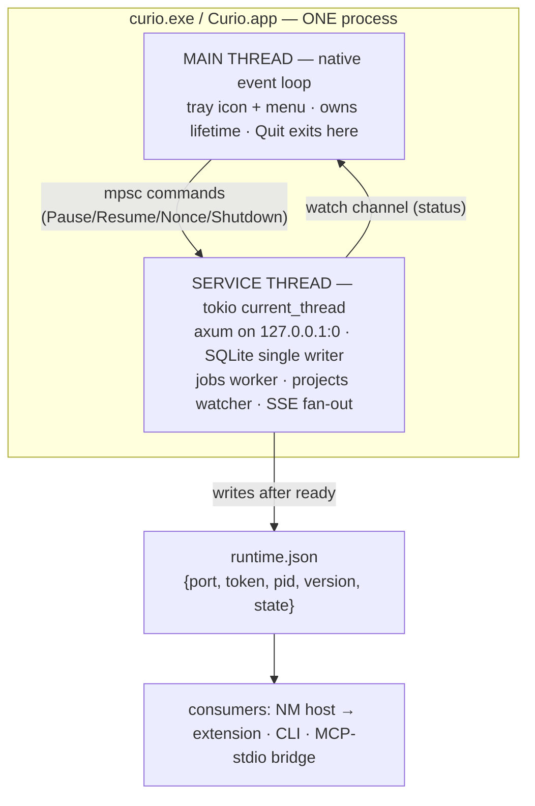
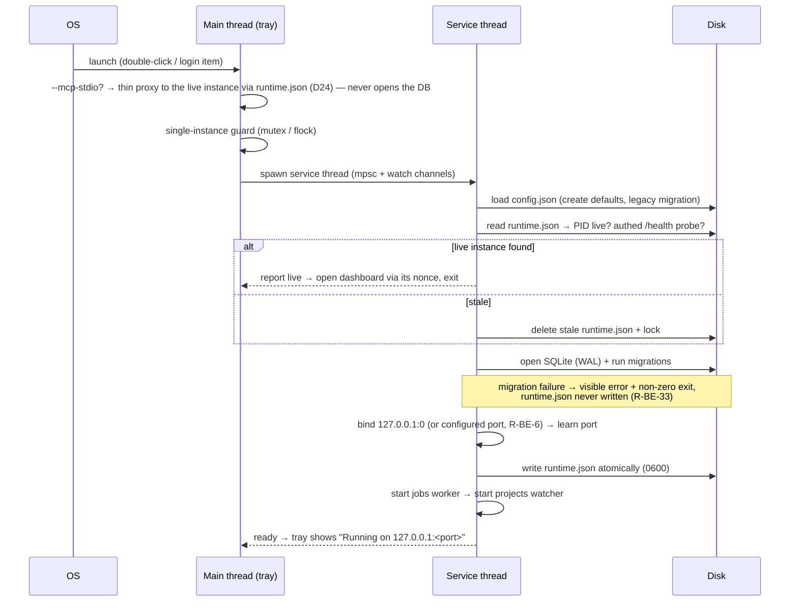

> TL;DR: Curio is one program and one process. The system-tray icon runs on the main thread and owns the app's lifetime; everything real — web server, database, background jobs, folder watcher — runs on a single service thread. "Off" pauses writing (mutations get a polite 503) while browsing keeps working, instead of killing the app. Each start, the server picks a random free port (unless a port is configured) and writes a small machine-only file, `runtime.json`, that tells every client (extension, CLI, MCP) where the app is and the secret needed to talk to it.

## At a glance

- One binary, two runtimes: native loop (tray) on main thread, tokio `current_thread` on the service thread. The mpsc channel between them is the only seam.
- Ephemeral port (`127.0.0.1:0`) + `runtime.json` discovery replaces the old fixed port 4321 + port-walk; an optional `port` override in `config.json` / `CURIO_PORT` env serves dev and unpacked installs (D11). No port-walk in any mode.
- Off = **soft-disable** (D25): listener stays bound, mutations return `503 + Retry-After`, reads/SSE/browsing keep working, MCP write tools get a clean JSON-RPC error, resume is instant.
- The HTTP surface is the Bun app's surface (Inventory §1) with one auth change: a single runtime bearer token (or the D22 session cookie) everywhere the pairing token used to be, plus a nonce endpoint for tokenless dashboard launch.
- Jobs, watcher, AI-call shapes, and event names are behavior-preserved from Inventory §3, §8, §9. Push is SSE for the SPA and WebSocket `/ws` for the extension (D13).
- Budget: ≤ 25 MB idle RSS, ~0% idle CPU (strategy §8; validated in Phase D0/P7, not assumed).

## The contract

**Process & lifecycle**

- R-BE-1: Curio MUST run as a single process. The native event loop (tray) MUST own the main thread; all service work MUST run on one tokio `current_thread` runtime on a dedicated service thread. (macOS requires UI on the main thread; Windows tray needs a message pump on its creating thread.)
- R-BE-2: Tray → service communication MUST go over an mpsc command channel (`Pause`, `Resume`, `RequestNonce`, `Shutdown`, `QueryStatus`); service → tray over a watch/status channel. No other cross-thread state sharing.
- R-BE-3: **Off = soft-disable (D2, D25).** The listener stays bound. When paused, middleware MUST return `503` with `Retry-After` for every **mutating** `/api` route and capture ingestion; **read** routes, SSE (`/api/events`), `/ws`, `GET /health`, and the SPA shell/assets continue to work. `/mcp` passes through the middleware; write tools are refused at dispatch with a clean JSON-RPC error while read tools keep working ([ARCH-05](05-mcp-architecture.md) R-MCP-10). `POST /api/auth/exchange` and `POST /api/system/quit` stay exempt. The jobs worker pauses; the watcher keeps its state. `runtime.json.state` MUST reflect `"running" | "paused"`.
- R-BE-4: Single instance MUST be enforced (named mutex on Windows, `flock` lock file on macOS) before any other side effect. A second launch MUST probe the live instance and, if alive, open the dashboard (via nonce, R-BE-11) and exit; if stale, reclaim lock and `runtime.json`.
- R-BE-5: Boot order MUST be: stdio-bridge branch → single-instance guard → load `config.json` → live-instance probe → open DB + run migrations → bind `127.0.0.1:0` → write `runtime.json` (atomic temp+rename, owner-only perms) → start worker → start watcher → signal tray "ready". `runtime.json` MUST NOT exist before migrations and bind both succeed (a half-migrated DB is never advertised).
- R-BE-6: The port MUST be OS-assigned per run **by default**. `config.json` MAY carry an optional `port` override (absent by default = ephemeral); the `CURIO_PORT` env var wins over config, and the legacy `CURIOL_PORT` env var is honored when `CURIO_PORT` is unset. There is no port-walk in any mode: one address, bound or failed. (D11 — see the decision register in [ARCH-00](00-architecture-overview.md).)
- R-BE-7: Shutdown order MUST be: quit signal → stop watcher → stop worker (finish/park current job) → graceful server stop → WAL checkpoint → close DB → delete `runtime.json` → release lock → exit 0. The quit route MUST answer HTTP first, then shut down after a short grace (~150 ms) (Inventory §8).
- R-BE-33: **Migration failure is loud.** If migrations fail — or the database is newer than the binary — boot MUST fail visibly: non-zero exit, an OS-level notification / tray error state, and a log line naming the current and expected schema versions. `runtime.json` is never written (R-BE-5), so no client ever discovers a half-migrated instance. Migration mechanics are owned by [ARCH-02](02-data-architecture.md) R-DA-18.
- R-BE-34: **Staleness checks are asymmetric.** `curio-nmh` performs a PID-liveness check ONLY against `runtime.json` — it embeds no HTTP client. If the recorded pid is dead it replies `{state: "stale"}` and the extension treats that as not-running ([ARCH-04](04-extension-architecture.md)). The full staleness check — the authenticated `/health` probe — remains a server-boot responsibility (R-BE-4, R-BE-5).

**HTTP contract**

- R-BE-8: The route surface and semantics of Inventory §1 MUST be preserved verbatim except where rules below amend them: items, bulk, vocabulary, prompts, projects, settings, system, pairing (`POST /api/pair/authorize`, R-BE-9), `/files`, `/p/:id`, `/health`, `/api/events`, `/ws` (R-BE-32), `/mcp`. Route order MUST keep `/mcp` above the SPA catch-all; the SPA fallback MUST 404 `/api|/files|/p/` and build-asset paths.
- R-BE-9: **One token model.** Every authenticated route uses `Authorization: Bearer <token>` with the runtime token — the legacy `x-curio-token` header is gone — and token protection extends to all `/api/*` routes and `/mcp`. The token is **per-run**: minted at each service start, invalidated at quit (D21). `POST /api/pair/authorize` and the `/pair` page are the sanctioned **fallback pairing path** (D11): the endpoint returns the current runtime token, exposed on the SPA side only through the click-gated DOM handoff ([ARCH-03](03-frontend-architecture.md); gates and rationale in [ARCH-06](06-security-architecture.md) R-SEC-3/R-SEC-4). Token lifecycle and rationale: [ARCH-06](06-security-architecture.md).
- R-BE-10: `POST /api/system/quit` MUST authenticate with the separate quit token from the lock file — never the runtime token (Inventory §10.3; [ARCH-06](06-security-architecture.md) R-SEC-8).
- R-BE-11: Nonce endpoints: `POST /api/auth/nonce` (auth: bearer; also reachable via mpsc from the tray) → `{nonce}`; `POST /api/auth/exchange` `{nonce}` (no auth, same-origin only) → sets the HttpOnly, `SameSite=Strict`, session-scoped cookie that authenticates subsequent browser requests (D22). Nonces are 30 s, single-use ([ARCH-06](06-security-architecture.md) R-SEC-5).
- R-BE-12: `GET /health` stays unauthenticated and cross-origin-readable BY DESIGN with exactly `{status, version, port, items, queue, api_key_configured}` — the extension's status dot depends on it (Inventory §10.29; field whitelist owned by [ARCH-06](06-security-architecture.md) R-SEC-11).
- R-BE-13: Body cap 64 MB (matches the 20,000-device-px stitch cap, Inventory §10.31); idle timeout 120 s; bind loopback only.
- R-BE-14: Middleware per route group MUST follow the table in Design detail §"Middleware map"; rationale lives in [ARCH-06](06-security-architecture.md).

**Events**

- R-BE-15: SPA push is SSE at `GET /api/events`: `hello` on connect, `ping` every 20 s; event names and payloads exactly as Inventory §3 (`item.created` full item, `item.updated`, `item.deleted {id}`, `project.detected`, `project.updated`, `job.updated` full-or-partial, `vocabulary.updated {}`). Clients merge `job.updated` partials by id (Inventory §10.30). The extension's push channel is `/ws` (R-BE-32); both are served, neither replaces the other (D13).
- R-BE-32: **Extension push is WebSocket at `GET /ws`** (D13, D23). Auth is by first message: the client MUST send the runtime token within 5 s of connect or the server MUST close the socket — no token in the URL or headers. On successful auth the server replies `hello {state, version}` and thereafter pushes `state` changes on every pause/resume. The client pings every 20 s; the server MUST tolerate that keepalive interval, and either side MAY ping. Pausing does NOT close the socket — the paused state is announced, not disconnected. Client-side behavior: [ARCH-04](04-extension-architecture.md).

**Jobs & worker**

- R-BE-16: Job kinds: `assess_item`, `bulk_retag`, `vocab_dedupe`, plus new `embed_item {item_id}` (vector generation — post-v1, activated with the vector layer per D7). One worker loop on the service thread; claim = oldest queued job whose `not_before` is null or due, atomically marked running; FIFO order and tie-breaks rest on monotonic ULIDs (Inventory §10.9; schema in [ARCH-02](02-data-architecture.md)).
- R-BE-17: Failure semantics MUST be preserved exactly: missing-API-key → requeue WITHOUT consuming an attempt, 30 s backoff, item stays `processing` (FR-26); other errors retry while `attempts < 3` with backoff `2000·attempts²` ms; exhausted → job `failed` + item `assessment_failed`. `JobParked` → stay queued, set `not_before`, **refund the attempt**; `not_before` cleared on finish/requeue (Inventory §10.10).
- R-BE-18: Bulk membership is FROZEN at enqueue (ids only). `< 8` items → serial (resumable via `progress.done`); `≥ 8` → Anthropic Batch API (`custom_id` = item id), job parks and polls every 5 s. **D33: the re-tag call is text over the item's stored description, not a second vision call**; re-assess remains the vision path. Cap 500; over-cap → `409` naming `matched` + `limit`, never trimming (Inventory §10.11). Progress lives in `jobs.result`; publish every 10 items.
- R-BE-19: Cancellation MUST be polled at every boundary; cancelling a batch-backed job MUST also cancel the Anthropic batch. Startup MUST reclaim orphaned `running` jobs to `queued`.

**Projects watcher**

- R-BE-20: Watch `projectsRoot` at depth 0 with write-settle debounce (≈2 s stability); new top-level dir → register entry within 5 s (FR-17); dir removal → mark `missing`, never delete (FR-19).
- R-BE-21: Project identity is the `.curio-project` marker file `{id: ulid, tool, note}` → fingerprint `mark:<ulid>`. Scans are read-only; the marker is minted only on adoption; copies get fresh identity; fingerprints are never overwritten (Inventory §8, §10.17 — inode/birthtime identity is proven unsound). Prompt claim on first sighting only, 6 h window, claim cleared even when expired.
- R-BE-22: `GET /api/projects` MUST keep its reconcile + relocate-missing side effects (Inventory §10.28). Entry-point resolution: root `index.html`, else newest numeric subfolder with one, else filtered listing.

**AI integration**

- R-BE-23: Visual assessment is ONE structured-output call to the vision model (FR-4): `max_tokens 8000`, `effort medium`, json_schema output, system prompt with exactly TWO cache breakpoints (rubric | vocabulary — one breakpoint measured zero cache reads); user turn = base64 image + source/title/thresholds with the "do not apply thresholds yourself" instruction (Inventory §9, §10.7).
- R-BE-24: Utility calls: `max_tokens 2000`, single cached system block, and NO `effort` parameter (Haiku rejects it) (Inventory §10.7). Dedupe output schema MUST keep `reason` as the FIRST property; empty merge list = withdrawal; post-filter drops hallucinated names and self-merges (Inventory §10.8).
- R-BE-25: Assessment output schema (re-validated in Rust): `{name_suggestion, short_description, design_types[], tags[], family_scores[{family, score}], new_family_proposal{name,description}|null, image_recipe|null}`. Write-back is app code, no model, atomic across DB + sidecar (FR-5); family decision follows PRD §6.4 thresholds read from settings; user-renamed items keep their names (Inventory §10.12).
- R-BE-26: Image downscale rules (**amended by D32: the container is JPEG, not WebP — quality numbers, crop rules, dimension caps and the degrade rule are unchanged**): thumbnail 640 px q82 cropped to first fold (viewport aspect, fallback 16/10, clamp 0.5–4); vision payload ≤ 1568 px q88, tall images cropped to 4× width; ALL image-processing failures degrade to full-res PNG (Inventory §9).
- R-BE-27: Embeddings sit behind an `Embedder` trait in `curio-core` (strategy §5.2). Embedding generation is the `embed_item` job kind (post-v1) — asynchronous, queued, and subject to R-BE-17 semantics. The daemon MUST NOT link a model runtime; implementations call a local model or external API chosen per [ARCH-02](02-data-architecture.md). Vector storage/query is owned by [ARCH-02](02-data-architecture.md).

**Settings, config, crates, budget**

- R-BE-28: `config.json` (user-editable, rewritten on boot/save): `dataRoot`, `projectsRoot`, `thresholds{lower,upper}` (default 0.4/0.5, reject lower>upper), `models{vision,utility}`, `mcpEnabled` (default false), `sendToClaudeTarget`, `launchAtLogin` (OS is authority), and optional `port` (absent by default = ephemeral; precedence per R-BE-6). GONE vs Inventory §5: `pairingToken` (replaced by the runtime token). Env/flags: `CURIO_PORT` (R-BE-6), `CURIO_DATA_ROOT` (R-BE-29), and `CURIO_NO_OPEN=1` / `--no-open`, which suppresses the browser-open at boot (Inventory §5 parity). `runtime.json` is a SEPARATE, machine-written, owner-only file — never user-edited, never merged into config, deleted on quit.
- R-BE-29: Data-root resolution and legacy compat preserved: `CURIO_DATA_ROOT` → deprecated `CURIOL_DATA_ROOT` (warn) → one-time `~/Curiol`→`~/Curio` migration before target mkdir (Inventory §5, §10.18); seed `skills/visual-assessment.md` once, never overwrite.
- R-BE-30: Crate layout and dependency direction MUST follow the table in Design detail §"Crates". `curio-db` is the ONLY crate that sees SQL; dependencies point inward to `curio-core`; `curio-nmh` depends on no workspace crate that pulls tokio/axum — its one permitted workspace dependency is `curio-runtime` (D27), which is serde-only by construction.
- R-BE-31: The resource budget table (Design detail §"Budget") is binding: numbers are targets validated in D0/P7, and regressions block release until measured and consciously re-budgeted.

## Design detail

### Boot sequence

Shutdown mirrors R-BE-7 in reverse; tray "Quit" and `POST /api/system/quit` converge on the same mpsc `Shutdown` command.

### Middleware map (what applies where)

Rationale, header rules, and jail semantics are owned by [ARCH-06](06-security-architecture.md); this table is the wiring order.

| Route group | Host/Origin 403 | Soft-disable 503 (D25) | Auth | Extra |
|---|---|---|---|---|
| `GET /health` | no (open by design) | exempt | none | field whitelist R-BE-12 |
| SPA shell + assets, `GET /` | Host only | exempt (shows paused UI) | none | SPA fallback 404 rules |
| `POST /api/auth/exchange` | yes | exempt | nonce | 30 s single-use; sets session cookie (D22) |
| `POST /api/auth/nonce` | yes | exempt | cookie or bearer | also via mpsc |
| `POST /api/pair/authorize` | yes | exempt | same-origin + `Sec-Fetch-Site` + SPA click gate ([ARCH-06](06-security-architecture.md) R-SEC-3) | fallback pairing (D11) |
| `/api/*` reads (incl. SSE `/api/events`) | yes | no — reads continue | session cookie or bearer (D22) | — |
| `/api/*` mutations + ingest | yes | yes (`503` + `Retry-After`) | session cookie or bearer | 64 MB cap on ingest |
| `POST /api/system/quit` | yes | exempt | quit token only | timing-safe compare |
| `GET /ws` | yes | no — socket stays open, `state` pushed | first-message token, 5 s deadline (R-BE-32) | 20 s client keepalive tolerated |
| `/files/items/:id/:file` | yes | no (reads continue) | session cookie or bearer (same-origin `` carries the cookie) | path jail; thumb→screenshot fallback |
| `/p/:id`, `/p/:id/*` | yes | no (reads continue) | session cookie or bearer | jail + `projectServeRefusal` |
| `/mcp` | yes — own middleware in front of rmcp | pass-through; write tools refused at dispatch ([ARCH-05](05-mcp-architecture.md) R-MCP-10) | bearer | `mcpEnabled` gate per request |

### HTTP surface (delta view)

Everything in Inventory §1 carries over 1:1 — items CRUD + keyset pagination + facets, reassess, resolve-grayzone with its PATCH auto-promote rule, bulk retag/edit/dedupe, vocabulary CRUD + merge with in-transaction FTS/sidecar rebuild, prompts CRUD + serialize + sent-claim, projects register/open/static, settings GET/PUT with its side-effect list, system open-skill-file / send-to-claude / reveal / quit. Deltas only:

| Change | Old (Bun) | New (curio) |
|---|---|---|
| API auth | `x-curio-token` = pairing token, ingest only | `Authorization: Bearer` runtime token (or D22 session cookie) on all `/api/*` + `/mcp` |
| Pairing | `POST /api/pair/authorize`, `/pair` page, DOM handoff — primary path | NM host hands `{port, token, state}` to the extension; `/pair` + `POST /api/pair/authorize` stay as the click-gated fallback (D11) |
| Dashboard launch | plain URL open | `/?t=<nonce>` + `POST /api/auth/exchange` → session cookie |
| Port | config `port` 4321, walk 4321–4331 | ephemeral by default; optional config `port`, `CURIO_PORT` > config, legacy `CURIOL_PORT` honored (D11); no walk; `runtime.json` discovery |
| Settings reply | `restartRequired` on port change | field dropped (port override is config-file/env only, read at boot) |
| New | — | `POST /api/auth/nonce`, `POST /api/auth/exchange`, `GET /ws` (R-BE-32) |

### Jobs worker

Single loop, settings re-read per job, wake on notify + 2 s poll. The state machine per Inventory §9: `queued → running → done|failed|cancelled`, with parking (`not_before`) as a queued-with-a-timer state. Freeze-at-enqueue means a bulk job is immune to filter drift after submission. The `embed_item` kind (post-v1) reuses the identical machinery — parking covers rate limits, the missing-key refund covers offline queueing, and batch eligibility (≥ 8) MAY apply if the chosen embedder supports batching (D0).

### Crates

| Crate | Responsibility | Depends on |
|---|---|---|
| `curio-core` | Domain types, assessment/decision logic (thresholds, family rules), job kind definitions, `Embedder` trait, serialization rules | — |
| `curio-db` | rusqlite (bundled) + sqlite-vec + migrations + FTS5/LIKE fallback; the ONLY SQL crate | `curio-core` |
| `curio-server` | axum router, middleware stack, SSE, SPA embed (rust-embed/include_dir), jobs worker loop, projects watcher, `runtime.json` writer | `curio-core`, `curio-db` |
| `curio-mcp` | rmcp service + 7-tool v1 surface (9 with the post-v1 semantic pair), stdio proxy subcommand — thin proxy to the live instance via `runtime.json`, never opens the DB (D24; [ARCH-05](05-mcp-architecture.md)) | `curio-core` |
| `curio-tray` | `main.rs`: native loop (tray-icon + tao/winit), menu, mpsc, spawns service thread, autostart toggles | `curio-server`, `curio-mcp` |
| `curio-nmh` | Native-messaging micro-binary: read `runtime.json`, PID-liveness check only (R-BE-34), reply `{port, token, state}` (`state: "stale"` when the pid is dead), exit. Millisecond start; no tokio/axum, no HTTP client | `curio-runtime` |
| `curio-runtime` | The `runtime.json` shape and its atomic-write/owner-only-permission helpers — nothing else. serde + serde_json only, so depending on it costs `curio-nmh` no startup time (D27; R-DEL-2's sanctioned shared types module) | — |
| `xtask` | Gate script (R-DEL-6) and measurement tooling (`footprint`). Dev-only; never shipped, never a dependency of a shipped crate (D27) | — |

### Budget (strategy §8 — binding targets)

| Metric | Target | Owner of delta |
|---|---|---|
| RSS idle (private) | ≤ 25 MB | tray loop + UI residency + SQLite page cache (`PRAGMA cache_size` cap) |
| CPU idle | ≈ 0 % | event-driven tray; no polling |
| Wakeups/s idle | low single digits | coalesced timers; watcher is event-driven |
| Energy | no sleep inhibition; EcoQoS on service thread (Win) | never `timeBeginPeriod`; main thread stays default QoS |
| Binary size | report & track | + sqlite-vec (~hundreds of KB) + embedded SPA |
| DB growth | linear in captures; WAL checkpoint on pause & quit | vacuum only on explicit user action |

## Parity obligations

- FR-2, FR-3, FR-26 — ingest routes, immediate `processing` visibility, offline queueing (R-BE-8, R-BE-17).
- FR-4, FR-5, FR-6, FR-9, FR-11 — assessment call shape, deterministic write-back, thresholds, re-assess, bulk + Batch API (R-BE-23…R-BE-26, R-BE-18).
- FR-17, FR-18, FR-19 — watcher 5 s detection, project serving, missing-not-deleted (R-BE-20…R-BE-22).
- FR-23, FR-24, FR-25 — packaged tray app, single instance + deterministic client re-discovery (now via `runtime.json` instead of port fallback), server survives tab close (R-BE-1…R-BE-7).
- FR-27 — MCP mounted but detail owned by [ARCH-05](05-mcp-architecture.md); the `mcpEnabled` per-request gate at `/mcp` (which gates both transports — the stdio proxy forwards into it; supersedes the old always-on stdio, ARCH-08 break #11) and route order are backend obligations (Inventory §10.6).
- Inventory: §1 (routes, body cap, route order), §3 (events), §5 (config minus `pairingToken`; optional `port`, env compat incl. `CURIO_NO_OPEN`), §8 (boot/shutdown/watcher/marker identity), §9 (jobs + AI invariants), §10.6–.12, §10.15–.20, §10.28, §10.30–.31.
- Schema/SQL parity (tables, ULIDs, FTS, timestamps) is owned by [ARCH-02](02-data-architecture.md); security invariants §10.1–.5, §10.29 by [ARCH-06](06-security-architecture.md); extension-side behavior §7, §10.23–.24 by [ARCH-04](04-extension-architecture.md).

## Open questions

- OQ-1 (D0-verify; blocks: D0): `sqlite-vec` pin vs fallback (Vec1 / FTS5-only-defer) — decided in [ARCH-02](02-data-architecture.md); backend only assumes "vectors queryable in the same SQLite connection".
- OQ-3 (owner decision; blocks: P2 (v5 migration), shared with [ARCH-02](02-data-architecture.md) OQ-2): default `Embedder` implementation (local model vs external API) and its model slot in settings — (post-v1) PRD §3's no-embeddings non-goal stands for v1; vector+graph activate post-v1 per D7 as amended (2026-07-31), so this blocks the vector-activation release, not v1.
- OQ-4 (D0-verify; blocks: D0): tray-crate behavior (tray-icon + tao/winit) on both OSes and empty-shell RSS ≤ 12 MB gate (strategy §9 D0).
- OQ-5 (D0-verify; blocks: D0): EcoQoS via `SetThreadInformation` on the service thread — confirm thread-granularity behavior and the ControlMask/StateMask gotcha on Windows 11.
