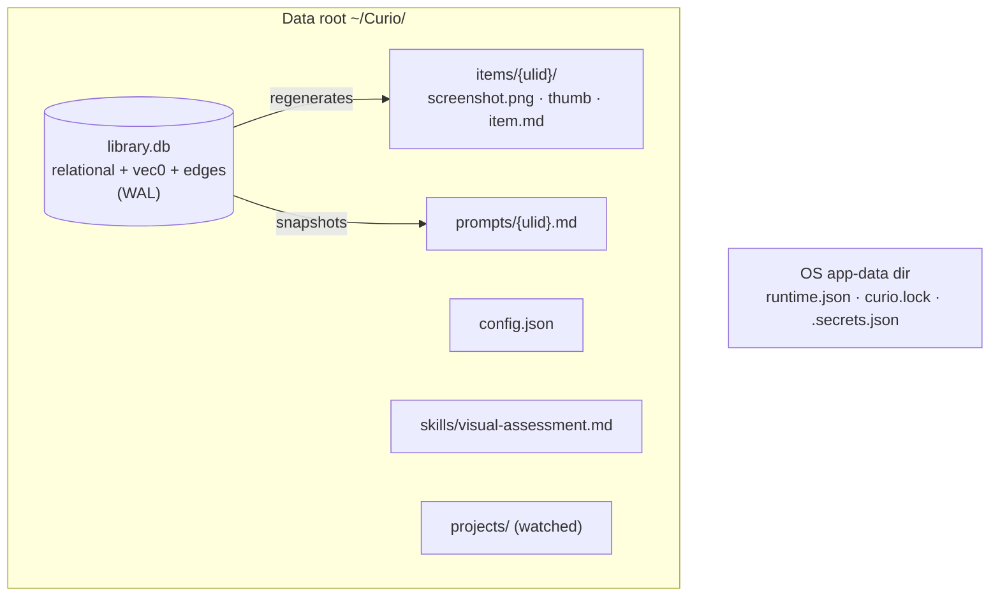

# Data Architecture

> **TL;DR:** Everything the user owns lives in one folder; everything structured lives in one SQLite file inside it. That file plays a normal relational role in v1, with two further roles designed in and activated post-v1 (D7) — a vector index for "find things that *look like* this", and a small graph for "find things *connected to* this". Human-readable markdown sidecars are generated beside every item so any AI agent can read the library with no API at all.

## At a glance



- **Parity first (D20):** same data-root layout, same tables, same lineage — an existing `library.db` opens in the Rust app and is migrated forward, never re-imported.
- **Designed in this architecture, activated post-v1 (D7):** an embeddings virtual table (`vec0`) and a two-table property graph. **New in v1:** the runtime/lock/secrets files moving out of the data root into the OS app-data directory.
- Backup story: copy `library.db` (+ WAL) and the data root. That's all of it.

## The contract

### Ownership and layout
- **R-DA-1** All user-owned artifacts MUST live under a single configurable data root (FR-1), laid out exactly as the old app: `library.db`, `config.json`, `skills/visual-assessment.md` (seeded once, never overwritten), `items/{itemId}/` (screenshot.png required, `screenshot.thumb.webp`, `item.md`), `prompts/{promptId}.md`, `projects/`.
- **R-DA-2** Machine-run state MUST live in the per-OS app-data directory, NOT the data root: `runtime.json`, the single-instance lock (with quit token), `.secrets.json` fallback. Rationale: the data root is user-shareable and project-servable; run state and secrets must never be either (Inventory §10.4's leak precedent). *This moves `curio.lock` and `.secrets.json` relative to the old app — a deliberate break recorded in [ARCH-08](08-parity-matrix.md).*
- **R-DA-3** Data-root resolution order and the one-time `~/Curiol`→`~/Curio` migration MUST be preserved, including its guards (only default root, target absent, legacy non-empty, never merge, failure falls back) and legacy env vars `CURIOL_DATA_ROOT`/`CURIOL_PORT` (Inventory §5, §10.18). Port resolution precedence is owned by [ARCH-01](01-backend-architecture.md) R-BE-6 (per D11).
- **R-DA-4** The database is the source of truth; sidecars and prompt snapshots are **write-only projections** regenerated inside the same transaction as every mutation. On any conflict, DB wins (Inventory §10.19).

### Identity and time
- **R-DA-5** IDs are **monotonic ULIDs** (same-millisecond ordering preserved). Load-bearing for FIFO job claims and keyset pagination (Inventory §10.9).
- **R-DA-6** Timestamps are ISO-8601 UTC at **second** precision — except `prompts.sent_at`, which keeps millisecond precision because it is an ordering key (Inventory §10.15).

### Relational core
- **R-DA-7** The shipped schema (items, aesthetic_families, design_types, tags, item_families with score/gray_zone/ai_proposed, item_types, item_tags, prompts, projects, jobs — columns and CHECK constraints per Inventory §4) is the v1 baseline and MUST NOT be renamed or re-shaped in the port. The editor-document column `prompts.doc_json` keeps its TipTap JSON shape (D16).
- **R-DA-8** rusqlite with bundled SQLite; WAL; `synchronous=NORMAL`; `foreign_keys=ON`; `busy_timeout=5000`; **one writer connection owned by the service thread**; page cache capped via `PRAGMA cache_size` against the [ARCH-01](01-backend-architecture.md) budget. Read pool only if profiling demands it.
- **R-DA-9** WAL checkpoint on Pause and on Quit; `VACUUM` only on explicit user action.
- **R-DA-10** Full-text search uses FTS5 (`items_fts(item_id UNINDEXED, name, short_description, tags_concat, unicode61)`), kept in sync inside every write transaction; query builder quotes terms, prefix-matches the last, ANDs them. Because we bundle SQLite, FTS5 is always present — the old LIKE fallback (Inventory §10.27) is retired. *Deliberate break, recorded in ARCH-08.*
- **R-DA-11** Referential quirks preserved: `projects.prompt_id` has no ON DELETE, so prompt deletion MUST null it first (Inventory §10.16). Family merge keeps `MAX(score)`/`MIN(gray_zone)` per item; tag/type merge is insert-or-ignore + delete; orphan vocabulary pruned after deletes/replaces (Inventory §10.14).

### Vector role (designed in, activated post-v1 per D7)
Post-v1: nothing in this section ships in v1; it is the pre-agreed design for the activation release.
- **R-DA-12** One embeddings virtual table, `item_vec` (vec0), one row per item, embedding of `name + short_description + tags + families text` — **text embeddings of the AI's own description, not raw image embeddings** (the assessment already compresses the visual into words; this keeps the embedder swappable and the vectors cheap). Dimension is fixed per embedder config; changing embedder or dimension truncates and rebuilds the table via a migration.
- **R-DA-13** Embedding generation is a **job kind** (`embed_item`), enqueued after assessment write-back and on any text-changing edit; it MUST degrade exactly like assessment does (no key / offline → queued, never blocking ingestion). KNN queries MUST treat a missing vector as "not yet searchable", never as an error.
- **R-DA-14** Vector search is brute-force-class and that is **fine at 10⁴–10⁵ rows** (strategy §5.2). The ANN trigger is D3's reversal clause, not a v1 concern. D0-verify: `sqlite-vec` loading from rusqlite on both OSes, or fall back per D8.

### Graph role (designed in, activated post-v1 per D7)
Post-v1: nothing in this section ships in v1; it is the pre-agreed design for the activation release.
- **R-DA-15** Property graph in two tables exactly as strategy §5.3: `nodes(id, kind, ref_id, props JSON)` and `edges(src, dst, kind, weight, props, PRIMARY KEY(src,kind,dst)) WITHOUT ROWID` + `edges_dst` index. `ref_id` is the referenced entity's **ULID (TEXT)** — never a SQLite rowid, which `VACUUM` or dump/restore may renumber out from under the graph. v1 node kinds: `item`, `domain`, `family`, `tag`, `type`, `project`, `prompt`. v1 edge kinds: `tagged_with`, `typed_as`, `in_family` (weight = score), `same_domain`, `from_prompt`, `produced_project`. This document owns the node-kind and edge-kind vocabulary; other docs (e.g. [ARCH-05](05-mcp-architecture.md)) cite it, never restate it.
- **R-DA-16** Graph rows for library relationships are **derived** from the relational link tables (rebuilt in the same transaction that changes them), so the graph can never disagree with the library. Only edge kinds with no relational home (`same_domain`, future `links_to`) are first-class.
- **R-DA-17** Traversals are bounded-depth `WITH RECURSIVE` CTEs. The canonical hybrid query — KNN ∩ ≤2-hop neighborhood ∩ relational filters — MUST be expressible as one SQL statement (strategy §5's payoff), and is the acceptance test for this whole layer (strategy Phase 2 exit).

### Migrations
- **R-DA-18** `PRAGMA user_version` stepping continues the shipped chain (v4 is current). Each migration runs in its own transaction; a database newer than the binary MUST refuse to open (SchemaTooNewError semantics); `runtime.json` is written only after migration succeeds, so a half-migrated DB is never advertised (strategy §5.4). A migration failure or too-new database is a boot failure: the app exits visibly per [ARCH-01](01-backend-architecture.md)'s boot-failure rule, never a live tray icon over a broken database.
- **R-DA-19** v5 (the vector-activation migration, post-v1) adds: `item_vec` virtual table, `nodes`/`edges`, the derived-graph backfill, and an `embeddings` config row (embedder id + dimension); v1 ships on the existing chain ending at v4. Nothing in v5 rewrites existing user data.
- **R-DA-20** Migration state is user-visible: the app MUST be able to report current/pending versions, and agents MUST never auto-run migrations outside the boot path (project convention).

## Design detail

### Why text embeddings, not image embeddings
The assessment pipeline already pays a frontier vision model to describe each screenshot in the library's own vocabulary. Embedding that text (a) reuses the paid-for signal, (b) keeps vectors small and the embedder swappable behind the D9 trait, and (c) means semantic search speaks the same language the user browses in. Raw image embeddings would add a second model dependency for marginal gain at this scale; the reversal trigger is user-visible search misses that the text demonstrably can't cover.

### The sidecar contract (unchanged)
`item.md` = YAML frontmatter (id, name, source_url, timestamps, last_edited_by, status, design_types, per-family name+score+flags, tags, screenshot path) + `## Short Description` + optional `## Image Recipe`. Prompt snapshots carry the "Edits here are not read back" header. Agents may consume the library with `cat` alone.

### Hybrid query shape (illustrative, non-normative)
```sql
WITH near AS (SELECT item_id, distance FROM item_vec
              WHERE embedding MATCH :query_vec ORDER BY distance LIMIT 50),
     hood AS (SELECT dst AS node FROM edges WHERE src = :anchor AND kind='same_domain'
              UNION SELECT e2.dst FROM edges e1 JOIN edges e2 ON e2.src = e1.dst
              WHERE e1.src = :anchor)
SELECT i.* FROM items i
JOIN near ON near.item_id = i.id
JOIN nodes n ON n.kind='item' AND n.ref_id = i.id AND n.id IN (SELECT node FROM hood)
WHERE i.status = 'ready' ORDER BY near.distance LIMIT :k;
```

## Parity obligations
FR-1 (single root), FR-5 (atomic write-back incl. sidecar), FR-10 (search/filters — FTS5 side), FR-19 (missing-project records). Inventory: §4 whole schema; §10.5 lineage quirks; §10.9 ULIDs; §10.14–§10.17 merge/timestamp/FK/marker rules (marker-file *behavior* is owned by [ARCH-01](01-backend-architecture.md); the `projects.fingerprint` column shape is owned here); §10.19 sidecars; §10.27 superseded by R-DA-10.

## Open questions
- **OQ-1 (D0-verify, blocks: D0→P2):** `sqlite-vec` from rusqlite on Windows + macOS, binary-size delta, and load-time; fallback decision per D8 if it fails.
- **OQ-2 (D0-verify, blocks: P2 v5 migration):** embedder default (D9): candidate remote APIs, dimension, cost per item — pick and pin during D0.
- **OQ-3 (owner, blocks: P2):** should `same_domain` edges be computed at ingest for all existing items during the v5 backfill (one-time cost on large libraries) or lazily? Recommendation: backfill — libraries are ≤10⁵ items by design.
