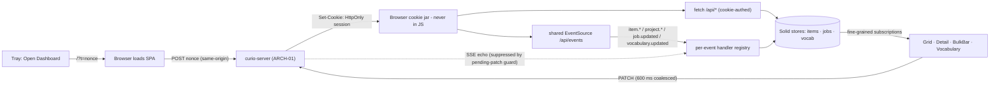

> TL;DR: The dashboard is a SolidJS single-page app, built with Vite and served from inside the curio binary itself — no separate web server, no CORS, no install step. It replaces the React app one-for-one: same routes, same list/selection/bulk behaviors, same editor feel. What changes is the machinery underneath (signals instead of hooks, a nonce-based session bootstrap instead of an unauthenticated API) — what must NOT change is any behavior a user or the extension can observe.

## At a glance

| Layer | Choice | Why (one line) |
|---|---|---|
| Framework | SolidJS + solid-router | Fine-grained reactivity: SSE events patch one card, not a tree diff |
| Styling | Tailwind 4 | Parity with the old app's styling layer (Inventory §10.32) |
| Editor | TipTap 3 framework-agnostic core (`@tiptap/core`, no React bindings) | Existing `prompts.doc_json` is TipTap JSON — schema continuity beats a rewrite (see Design detail) |
| Live updates | One shared `EventSource` on `/api/events` | Preserves the old app's SSE contract verbatim (Inventory §3) |
| Session | One-time nonce → HttpOnly `SameSite=Strict` session cookie (D22) | Token never in URL/history; reload survives — [ARCH-06](06-security-architecture.md) |
| Build/serve | Vite → static assets embedded in the binary (`rust-embed`/`include_dir`) | One origin, one file to ship — [ARCH-01](01-backend-architecture.md), [ARCH-07](07-delivery-open-source.md) |

- The SPA is a **client of contracts owned elsewhere**: HTTP/SSE shapes by [ARCH-01](01-backend-architecture.md), data semantics by [ARCH-02](02-data-architecture.md), auth by [ARCH-06](06-security-architecture.md).
- The `/pair` page survives, but demoted: it is the **fallback** pairing path now that native messaging bootstraps the extension ([ARCH-04](04-extension-architecture.md)).
- The SPA **never serializes prompts**; serialization is server-side and authoritative (Inventory §6).
- Route map, selection model, autosave timing, and capture-adjacent UX are **ported behaviors, not redesigns** — the numbered contract below is the checklist.

## The contract

### Framework & structure
- **R-FE-1** — The SPA MUST be SolidJS with solid-router, built by Vite, styled with Tailwind 4. No React, no VDOM layer, no SSR (paper §7: no SSR, Page Visibility to suspend).
- **R-FE-2** — Routes MUST mirror the old app exactly (Inventory §6): `/` (Library), `/items/:id`, `/projects`, `/prompts`, `/prompts/:id` (lazy-split), `/vocabulary`, `/settings`, `/pair` (registered above the catch-all, **eagerly loaded**), and `*` → NotFound.
- **R-FE-3** — The editor route `/prompts/:id` MUST be code-split (dynamic import). It was the measured split point in the old app; the editor stack (TipTap core + ProseMirror) MUST NOT load on any other route.
- **R-FE-4** — Build output MUST be static assets embedded into the Rust binary; asset serving, SPA-fallback rules, and route precedence (`/mcp` before catch-all, 404 for `/api|/files|/p/` and build-asset paths) are owned by [ARCH-01](01-backend-architecture.md). The SPA MUST NOT assume any origin other than its own (`fetch('/api/…')`, relative URLs only).

### State & session
- **R-FE-5** — State primitives: SolidJS **signals** for local component state, **stores** for shared entity caches (items, vocabulary, jobs), **resources** for fetch-backed reads. No external state library.
- **R-FE-6** — Session bootstrap (D22): on load the SPA MUST read the one-time nonce (`?t=<nonce>`), exchange it same-origin, and strip the nonce from the URL (`history.replaceState`). The exchange sets an **HttpOnly, `SameSite=Strict`, session-scoped cookie**; every subsequent `/api/*` call — including SSE — authenticates by that cookie, so a reload (F5) survives without a new nonce and the token itself never reaches SPA JavaScript, localStorage, or a bookmarkable URL. Nonce lifetime and the exchange endpoint are defined by [ARCH-06](06-security-architecture.md).
- **R-FE-6a** — **No-session state** (D22, normative): a visit with no session cookie and no nonce (a bookmarked tab, a tab restored after restart) MUST render a static "Open Curio from the tray" screen that quietly retries `/health` and never surfaces an error. Pages opened by the extension's popup (Projects / New Project) arrive with a nonce the extension requested via its token ([ARCH-04](04-extension-architecture.md)), so they land authenticated; only a plain bookmarked visit sees this screen.
- **R-FE-7** — Exactly **one** shared SSE client per app instance: a single `EventSource` on the events endpoint, per-event-name handler registry, reconnect after 2 s, `hello` on connect and `ping` every 20 s tolerated silently (Inventory §3). SSE authenticates via the session cookie (R-FE-6) — `EventSource` cannot send headers, and no header gymnastics are needed. Components subscribe to the shared client; they MUST NOT open their own streams.
- **R-FE-8** — When the server reports `paused` (soft-disable, D25: mutations 503, reads continue), the SPA MUST render an explicit **banner-level** paused state — browsing, search, and SSE keep working; mutating affordances are disabled with the paused explanation. It MUST NOT surface the 503s as generic errors, and MUST NOT interpose a full-page interstitial over a library that D25 keeps readable.

### Ported UX behaviors (observable contracts, Inventory §6 + §10)
- **R-FE-9** — Library grid: 200 ms debounced search; infinite scroll via IntersectionObserver (400 px rootMargin) driving **keyset pagination** (`created_at|id` cursor, never offset); view mode (`comfortable | dense | list`) persisted in localStorage key `curio.view`, migrating once from the older boolean `curio.dense`.
- **R-FE-10** — `item.created` MUST be **ignored** by the grid whenever any filter or search is active; it prepends only in the unfiltered view. `item.updated` replaces in place; `item.deleted` removes (Inventory §10.25).
- **R-FE-11** — Selection model MUST support exactly two modes: `picked(ids)` and `matching` (= the current filter). Shift-click ranges from the anchor; any filter change **voids** a `matching` selection but keeps picked ids; Escape clears selection. Cap is 500: over-cap is a **named refusal** (`overCapNote` surfacing the server's `matched`+`limit`), never a silent trim (Inventory §6, §10.11).
- **R-FE-12** — BulkBar lifecycle: picks up an in-flight `bulk_retag` on mount; merges partial `job.updated` payloads by id (Inventory §10.30); running = progress + Cancel; finished = summary / "Cancelled after N" / error + Dismiss; after bulk delete clears the selection, a `notice` keeps the bar mounted (Inventory §10.26). Vocab edits keep selection; delete clears it.
- **R-FE-13** — ItemDetail autosave: PATCHes coalesced at **600 ms**; a pending-patch guard MUST suppress SSE overwrites of fields with in-flight edits (Inventory §6).
- **R-FE-14** — Gray-zone decision UI: Keep nearest / Accept proposal (only when an `ai_proposed` link exists) / Move-to select; a human-picked family scores 1.0; families are edited whole-set (retained links keep score, new links = 1.0). Resolving clears the badge (FR-7, Inventory §10.13).
- **R-FE-15** — Prompt actions: Copy Prompt = serialize (server) → clipboard → mark sent. Send to Claude = serialize → copy → claim → launch; clipboard failure **aborts** the launch; UI says "Asked X to open", never "opened" (Inventory §10.22).
- **R-FE-15a** — Vocabulary page / ConsistencyPass: the latest dedupe result MUST survive a page reload (re-fetched from the server, not held only in memory); merges are applied client-side by calling the merge endpoints per group, with per-group **Merge** / **Keep both**; results are suggestions only — nothing auto-applies (Inventory §6, §10.8).
- **R-FE-15b** — ItemDetail auxiliary panels are part of parity: Copy Brief, Copy Image Prompt, Re-assess, Delete, the "Waiting for an API key" panel when no key is configured, and the agent-path copy block (Inventory §6).

### Editor
- **R-FE-16** — The editor MUST use TipTap 3 **core without React bindings**, mounted into a Solid-managed DOM node (decision rationale in Design detail).
- **R-FE-17** — Chip nodes are atoms with label fallback: `familyChip` ("◈ "), `tagChip`, `typeChip`, `itemRef` ("▣ "). Slash menu: `/` triggers only after allowed prefixes (space; never inside `http://`), two-stage (palette: aesthetic|style|type|item + aliases → live multi-select). Hidden `section` attr on paragraphs drives ghost-text for the 8 template sections (Inventory §6).
- **R-FE-18** — The SPA MUST NOT serialize prompts. It stores TipTap doc JSON via PATCH; the serialized text (chip expansion, path embedding, newline collapsing, sidecar snapshot) is produced solely by the server ([ARCH-01](01-backend-architecture.md); Inventory §6 "SERVER-side, authoritative").

### Pairing fallback
- **R-FE-19** — `/pair` remains, as the **sanctioned fallback** pairing path (D11) for installs where the native-messaging bootstrap is unavailable ([ARCH-04](04-extension-architecture.md)). The DOM-handoff contract is unchanged from the old app: the secret MUST be absent from the DOM until the user clicks "Authorize this browser"; then it appears only in the hidden handoff element (`#curio-pairing-handoff`, `data-curio-pairing-token`); re-click is harmless (Inventory §6, §10.21). What the element hands off is the **per-run runtime token**, obtained by the click via the re-instated `POST /api/pair/authorize` ([ARCH-01](01-backend-architecture.md); token rules in [ARCH-06](06-security-architecture.md)). Settings links to `/pair` with a full-document reload (content scripts inject at document load only).

### Keyboard & a11y (SHOULD — post-parity baseline)
These three rules are **SHOULD-level, post-parity baseline** quality bars, not FR-backed MUSTs; the old app's key map is the reference where a behavior has been verified against it (OQ-1).
- **R-FE-20** — Escape precedence, strictly ordered: (1) close the topmost open popover/menu/dialog, (2) clear grid selection, (3) no-op. One Escape SHOULD do one thing.
- **R-FE-21** — Popovers (filter pills, BulkBar panels, slash menu, gray-zone move-to) SHOULD move focus in on open, keep Tab cycling inside, and return focus to the trigger on close. The slash menu is fully keyboard-driven (arrows, Enter, Escape) without stealing focus from the editor caret.
- **R-FE-22** — The library grid SHOULD be keyboard-traversable (roving focus; Enter opens detail; Shift extends selection per R-FE-11); interactive cards are real focusable elements with accessible names, not click-only divs.

## Design detail

### Why SolidJS — a structural argument, not a benchmark
The paper's §12 explicitly **withdrew its SolidJS bundle-size figures as unverified**, so this doc does not cite numbers. The argument stands structurally:

1. **Fine-grained reactivity matches this app's update pattern.** Curio's dominant update is "one SSE event mutates one entity" (`item.updated` → one card). Solid compiles reads into direct subscriptions: an event patches exactly the DOM nodes bound to the changed fields. React re-renders a component subtree and diffs a VDOM to conclude nothing else changed — correct, but paid on every one of a long-running dashboard's thousands of push events.
2. **No VDOM runtime shipped.** Solid compiles templates to real DOM operations; the reconciler simply is not in the bundle. Whatever the exact byte count, removing an entire runtime layer moves in the direction the footprint budget (strategy §8) demands — the binary embeds these assets.
3. **The primitives map 1:1 onto what the React app already does.** `useState`→signal, entity caches→store, `useEffect`+fetch→resource, context→context. The port is a mechanical translation of hook code, not a paradigm shift — which is exactly the risk profile a parity rewrite wants.
4. **Escape hatch acknowledged:** Solid's ecosystem is smaller than React's. Curio needs a router, an editor mount, and Tailwind — all covered; no other React-only dependency exists in the inventory (§10.32).

### React → Solid translation map (non-normative porting guidance)
This table is **explicitly non-normative** — it guides the port, it binds nothing; only the numbered rules above are contract. The port is mechanical because every stateful pattern in the old app has one obvious Solid counterpart:

| Old app (React 19) | curio SPA (SolidJS) | Notes |
|---|---|---|
| `useState` | `createSignal` | Local component state |
| Entity caches via context/hooks | `createStore` per entity family (items, vocab, jobs) | SSE handlers are the sole server-truth writers |
| `useEffect` + fetch | `createResource` | Loading/error states come with the primitive |
| `useMemo`/`useCallback` | none needed | Fine-grained reactivity removes memoization ceremony |
| `useRef` + IntersectionObserver | element ref + `onCleanup` | Infinite-scroll sentinel (R-FE-9) |
| react-router 7 routes | solid-router, same paths | `/prompts/:id` stays the lazy boundary (R-FE-2/3) |
| Debounce/coalesce timers (200 ms search, 600 ms autosave) | identical timer logic | Timing values are contracts, not implementation detail |

### Data flow — nonce, session, SSE, stores

Store discipline: SSE handlers are the **only** writers that apply server truth to stores; optimistic UI writes are confined to the fields covered by the pending-patch guard (R-FE-13). This keeps "who wrote this value" answerable — the same property the old app's guard protected.

### The editor: TipTap core over raw ProseMirror
**Decision (one paragraph, as required):** TipTap 3 framework-agnostic core, not raw ProseMirror. The load-bearing fact is data compatibility: `prompts.doc_json` in every existing vault is TipTap 3 document JSON with TipTap-defined node/mark names and attrs (Inventory §4), and the old app's chip nodes, slash trigger rules, and section attr are expressed as TipTap extensions (Inventory §6). TipTap core has no React dependency — the React bindings are a separate optional package the old app happened to use — so the identical extension code mounts in a Solid component with a plain DOM element and an `onDestroy` teardown. Raw ProseMirror would buy one fewer dependency at the cost of re-deriving schema, keymap, and paste rules that TipTap already encodes, and of migrating or re-validating every stored document. Same-schema portability wins; ProseMirror remains reachable underneath (TipTap exposes it) if a plugin ever needs it.

Chip and menu contracts (R-FE-17) are ported verbatim; the serialized form of each chip is defined once, server-side ([ARCH-01](01-backend-architecture.md)), so the SPA renders friendly chips and never learns the serialization rules (R-FE-18).

### Pairing page as fallback
Under the native-messaging bootstrap ([ARCH-04](04-extension-architecture.md)), a normally-installed extension never needs `/pair`: it gets `{port, token, state}` from `curio-nmh`. `/pair` covers the cases NM cannot (D11): unpacked dev installs without registered NM manifests, a user who declined installer registration, or a future browser lacking NM support. The page's security posture is unchanged from the old app (R-FE-19) because its threat model is unchanged: the DOM handoff element **is** the authorization, so it must appear only on explicit click — what changed is the secret inside it, now the per-run runtime token minted to the page by `POST /api/pair/authorize` rather than a long-lived pairing token.

### Build & embed
`web/spa` builds with Vite to hashed static assets; the binary embeds them via `rust-embed`/`include_dir` and serves them with the fallback rules owned by [ARCH-01](01-backend-architecture.md). Release packaging, asset compression, and reproducibility are [ARCH-07](07-delivery-open-source.md)'s. Two SPA-side obligations: keep the editor chunk split (R-FE-3), and keep total asset weight visible in CI (binary size is a tracked budget line, strategy §8).

## Parity obligations

| Obligation | Source |
|---|---|
| Grid/filter/search/browse offline; graceful AI-degradation messaging | FR-10, FR-26 |
| Processing items visible immediately, update in place | FR-3; Inventory §6 |
| Every field editable, autosave, `last_edited_by=user` stamping surfaced | FR-8; Inventory §10.12 |
| Gray-zone badge + decision UI, resolution clears badge | FR-6, FR-7; Inventory §10.13 |
| Editor template, slash-commands, chip insertion, path-carrying references | FR-12, FR-13, FR-14; Inventory §6 |
| Copy Prompt / Send to Claude semantics and ordering | FR-15; Inventory §10.22 |
| Prompts autosave + list/reopen | FR-16 |
| Route map, lazy editor, eager pair, NotFound | Inventory §6 |
| SSE client shape (single EventSource, 2 s reconnect, per-name handlers) | Inventory §3 |
| item.created filter-gating; selection cap refusal; BulkBar notice | Inventory §10.25, §10.11, §10.26, §10.30 |
| ConsistencyPass reload-survival, client-applied merges, never auto-apply | Inventory §6, §10.8 |
| ItemDetail panels: Copy Brief/Image Prompt, Re-assess, API-key wait, agent path | Inventory §6; FR-9 |
| Autosave coalescing + pending-patch guard | Inventory §6 |
| Density persistence, keyset infinite scroll, Escape semantics | Inventory §6 |
| Pair-page DOM handoff gates | Inventory §6, §10.21 |

## Open questions

1. **(D0-verify, blocks: P3)** Exact keyboard map of the old app's `listKeyboard` helper (arrow/Home/End behavior, type-ahead?) — Inventory §6 records Escape and shift-click only; verify against the running Curiol app before treating R-FE-22's key map as the reference.
2. **(D0-verify, blocks: D0→P3)** TipTap 3 core mounted without React: confirm chip node views and the two-stage slash menu render cleanly from plain-DOM node views under Solid's lifecycle (spike in Phase D0; fallback is raw ProseMirror per template note).
3. **(D0-verify, blocks: P3)** Editor-chunk size after the Solid port — re-measure the split's payoff; the old app's numbers do not transfer and the paper's bundle figures are withdrawn.
