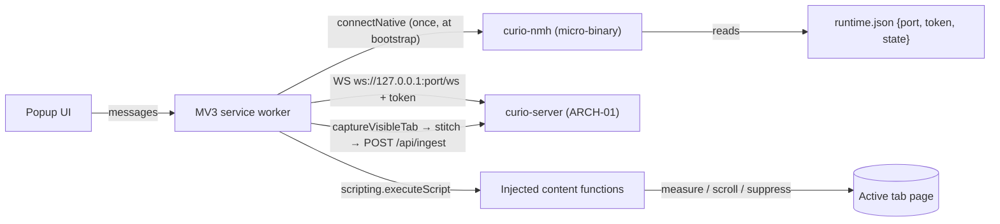

> TL;DR: The Chrome/Brave extension captures the current page (first fold by default, full-page stitch on request) and posts it to the local curio app. What's new in the rewrite: instead of guessing the app's port (probing 4321–4331) and asking the user to paste a pairing token, the extension asks a tiny native helper binary (`curio-nmh`) which reads the app's `runtime.json` and hands back `{port, token, state}` in one exchange. The old paths stay as fallbacks. The capture pipeline itself — the part users feel — is ported behavior-for-behavior from the working app.

## At a glance



- Four components: **popup**, **service worker**, **injected content functions** (no persistent content script except the `/pair` pickup), and the **`curio-nmh`** native-messaging host.
- Bootstrap is now **native messaging first**; port-probe + manual token paste + `/pair` handoff remain as the fallback ladder.
- The worker is stateless by design: MV3 kills it after 30 s idle; everything durable lives in `chrome.storage` under exactly `port`, `token`, `state`.
- Capture pipeline (fold/full, throttle, teardown, stitch) is a **verbatim port** of Inventory §7 — every ordering rule there was earned by a bug.
- The server pins the extension's origin from its manifest `key`; paused state flows from the handshake and stops capture at the source.
- Chrome/Chromium (incl. Brave) only in v1; Firefox/Safari posture noted, not built.

## The contract

### Components & identity
- **R-EXT-1** — The extension is MV3, plain TypeScript, minimum Chrome 116 (WS-resets-idle-timer floor). Permissions exactly as inventoried: `activeTab`, `scripting`, `storage`, `tabs`; host permissions for `127.0.0.1` and `localhost` (Inventory §7).
- **R-EXT-2** — The manifest MUST carry the pinned `key` so the extension id — and therefore its `chrome-extension://<id>` origin — is fixed; the server allowlists that one origin. This is one fact in two files (manifest + server config): a change to either without the other breaks capture and MUST be treated as a release-blocking check ([ARCH-07](07-delivery-open-source.md)) (Inventory §10.1).
- **R-EXT-3** — `curio-nmh` is a separate micro-binary (strategy A6): no tokio, no axum, no shared crate with the server beyond reading `runtime.json`'s schema. Chrome spawns it per connection; it MUST start in milliseconds.

### Bootstrap (new primary path)
- **R-EXT-4** — Primary bootstrap: the worker calls `runtime.connectNative` → `curio-nmh` reads `runtime.json`, replies a single message `{port, token, state}`, and exits. One connect, one reply, no long-lived channel, no bulk transport (paper §6).
- **R-EXT-5** — NM host framing: JSON UTF-8 with 32-bit native-byte-order length prefix; host→browser messages MUST stay under **1 MB**. stdout is reserved exclusively for framed messages — any diagnostic output goes to stderr (**stdout purity**; the classic NM defect).
- **R-EXT-6** — If `runtime.json` is absent, or its recorded PID is no longer alive, the host replies `{state: "stale"}` rather than exiting silently. Staleness detection is a **PID check only** — `curio-nmh` never makes HTTP calls (the staleness rules and their owner: [ARCH-01](01-backend-architecture.md)). The extension treats `stale` exactly as not-running: the popup renders the gray "Curio isn't running — launch it" state (FR-22: never attempt to launch the app).
- **R-EXT-7** — NM registration is written at install time — Windows registry `HKCU\SOFTWARE\Google\Chrome\NativeMessagingHosts\<name>` → manifest path; macOS per-user well-known path with absolute paths — owned by the installer ([ARCH-07](07-delivery-open-source.md)). The NM manifest's `allowed_origins` lists only the pinned extension origin (R-EXT-2).
- **R-EXT-8** — Fallback ladder, in order, used only when `connectNative` fails (NM registration absent — e.g. unpacked dev installs, declined installer step): (a) stored `port` from `chrome.storage`, then the legacy probe of ports **4321–4331** with 800 ms timeout against `/health` — kept deliberately, and coherent under D11's optional config-pinned `port`, which is the only case it can find; (b) token acquisition via the `/pair` page handoff of the per-run runtime token (D11; content script on `/pair` only: MutationObserver, idempotent; gates: pathname, element id, ≤512 chars, printable ASCII — Inventory §7, §10.21) or manual token paste in the popup. The fallback ladder MUST NOT run when NM succeeds.

### Worker lifetime & state
- **R-EXT-9** — Assume the worker dies at any moment (MV3 kills it after ~30 s idle). All durable state lives in `chrome.storage.local` under exactly three keys: `port`, `token`, `state`. Capture mode is NOT stored (stale-popup safety: anything ≠ `"full"` means fold — Inventory §7). No module-level globals carry state across events.
- **R-EXT-10** — The worker holds a WebSocket to `ws://127.0.0.1:<port>/ws`. The `/ws` contract — first-message token auth within 5 s, server `hello {state, version}`, state pushes — is owned by [ARCH-01](01-backend-architecture.md) (D23); this doc holds only the client's obligations: send the token as the first message, then an application-level ping every **20 s** — the canonical MV3 keepalive; active WS traffic resets the idle timer on Chrome 116+. On WS close: reconnect with backoff; on repeated failure, fall back to on-demand `/health` checks for the status dot.
- **R-EXT-11** — `state` updates arrive on the WS (`running|paused`) and on every (re)handshake. When `state = paused`, the extension MUST stop capturing — capture buttons disabled with an explanatory label — rather than posting into a 503 (strategy §4: "stops capturing rather than buffering into a void"). This `state` field is **new versus the old app**, which had no paused concept.

### Capture pipeline (verbatim port — Inventory §7, §10.24)
- **R-EXT-12** — Two modes as a total function over `frameBudget`: **fold** (budget 1, the default; any stored/received mode value other than `"full"` resolves to fold) and **full** (budget 60, hard cap **20,000 device pixels** of page height). Fold scrolls to top first so the same URL always yields the same image (FR-21).
- **R-EXT-13** — Pipeline order is normative: find server → require token → active tab is http(s) → **suppressPageChrome FIRST** (kill smooth-scroll, hide scrollbar) → **then measure** (hiding the scrollbar reflows layout — suppress-then-measure, never the reverse) → primeLazyContent (full only) → frame loop → stitch → POST.
- **R-EXT-14** — Frame loop: scroll to offset, sleep ≥ **550 ms** (captureVisibleTab rate limit), capture; `hideFixedElements` runs only **after frame 1**, only in **full** mode, only for elements < 90% of viewport height, via `visibility:hidden` (headers stay in the fold shot; sticky chrome doesn't repeat down the stitch).
- **R-EXT-15** — Teardown (restore fixed elements, scroll-behavior, styles, original scroll position) is **unconditional** — it MUST run on the failure path exactly as on success (FR-21; Inventory §10.24). No capture error may leave the page visually altered.
- **R-EXT-15a** — **Worker-killed-mid-capture recovery.** The injected suppression carries a **content-side watchdog**: if no progress ping from the worker arrives within **10 s**, the content script restores scroll, scrollbar, and fixed elements itself (the same teardown as R-EXT-15) — so a worker Chrome kills mid-capture cannot strand an altered page. A worker that wakes to find a stale in-flight capture record in `chrome.storage` clears it and re-arms nothing. P5's "survives worker termination" exit criterion ([ARCH-07](07-delivery-open-source.md)) cites this rule.
- **R-EXT-16** — Stitch: OffscreenCanvas, each frame drawn at `offset × devicePixelRatio`; output a single PNG; POST as multipart to `/api/ingest` with the `Authorization: Bearer <token>` header (the runtime token; the old `x-curio-token` header is gone with the pairing token), fields per [ARCH-01](01-backend-architecture.md) (screenshot, source_url, title, captured_at, viewport). The server's 64 MB body cap pairs with the 20k px cap (Inventory §10.31).

### Popup (Inventory §7, §10.23)
- **R-EXT-17** — Event listeners are registered **before the first `await`** in the popup script (a late listener misses the event that woke it). Buttons are disabled in HTML (not by later JS); the save-token control is enabled immediately.
- **R-EXT-18** — Both capture buttons disable **together** during any capture (they share the tab's scroll position). Toasts are verbatim: "Capturing the visible area…", "Stitching the full page… don't switch tabs.", "Added ✓" (auto-close 900 ms), "Captures will queue: no API key…". 401 handling is R-EXT-18a, not a toast of its own.
- **R-EXT-18a** — **401 recovery (D21).** A 401 from any authenticated call means the app restarted and the held token is stale — it is not a user-facing pairing failure. The worker MUST re-run the NM handshake **once** and retry the failed request with the fresh token, showing "Curio restarted — reconnecting…" meanwhile. Only if that re-handshake or retry fails does the extension surface state: "Can't reach Curio — open it and try again". The old "Pairing token rejected…" copy is retired along with the pairing token itself.
- **R-EXT-19** — Popup contents per PRD §8.1/FR-20: status dot (green = healthy via `/health` or live WS; gray = down with the launch-it message), settings gear → app Settings page, four actions (Add website / Add full-screen / Open Projects / New Project) with hover info glyphs. The Open Projects / New Project openers request a **one-time nonce** using the held token and open `http://localhost:<port>/…?t=<nonce>`, so the tab lands authenticated rather than on the no-session screen ([ARCH-03](03-frontend-architecture.md), [ARCH-06](06-security-architecture.md)). A paused server shows its own distinct state (R-EXT-11), not the gray "not running" dot.

### Non-Chrome browsers
- **R-EXT-20** — Firefox and Safari are out of scope for v1 (PRD §3). The only code-level accommodation: keep NM-manifest generation data-driven, because Firefox uses `allowed_extensions` (add-on id) where Chrome uses `allowed_origins`, and Safari routes native messaging through an app-extension model entirely. No runtime browser-detection branches ship in v1.

## Design detail

### Bootstrap — new primary, layered fallbacks

```mermaid
sequenceDiagram
  participant P as Popup
  participant W as Service worker
  participant N as curio-nmh
  participant S as curio-server
  P->>W: opened (needs status)
  W->>N: connectNative + request
  N->>N: read runtime.json (staleness check)
  N-->>W: {port, token, state} — then exit
  W->>W: chrome.storage.set {port, token, state}
  W->>S: WS connect ws://127.0.0.1:port/ws (token)
  S-->>W: hello + state; ping/pong every 20 s
  W-->>P: status dot green (or paused)
  Note over W,N: connectNative fails (no NM registration)?
  W->>S: stored port → probe 4321–4331 /health (800 ms) [legacy]
  P->>P: token via /pair handoff or manual paste [legacy]
```

Why this replaces port probing and token paste: the old app sat on a fixed default port (4321) with a short fallback walk, so probing worked; the rewrite binds `127.0.0.1:0` (ephemeral) and publishes the truth in `runtime.json` (paper §8.1, strategy §2). Native messaging is the only channel a browser extension has to read that file — indirectly, via a helper the installer registers. It also closes the last manual step: the token rides the same reply, so a fresh install captures with zero configuration. The legacy ladder (R-EXT-8) survives because dev installs are unpacked (different extension id possibilities notwithstanding, NM registration is an installer act) — and because a working escape hatch that costs three small code paths is cheaper than a support thread.

`curio-nmh` stays trivially small on purpose (strategy A6): Chrome launches it per connection, so its startup time is user-visible latency in the popup's status dot, and every dependency it shares with the server is a chance to drag tokio into a process that lives for one message.

### Capture — the sequence that must not change

```mermaid
sequenceDiagram
  participant P as Popup
  participant W as Worker
  participant T as Tab (injected fns)
  participant S as curio-server
  P->>W: capture(mode) — both buttons disabled
  W->>W: resolve server + token; state ≠ paused
  W->>T: suppressPageChrome (scroll-behavior, scrollbar)
  W->>T: measure page (AFTER suppression — reflow!)
  alt full mode
    W->>T: primeLazyContent
  end
  loop frames ≤ budget (fold: 1, full: ≤60, ≤20k device px)
    W->>T: scroll to offset
    W->>W: sleep ≥550 ms (captureVisibleTab throttle)
    W->>W: captureVisibleTab
    opt after frame 1, full only
      W->>T: hideFixedElements (<90% vh, visibility:hidden)
    end
  end
  W->>T: teardown — UNCONDITIONAL (also on any failure above)
  Note over T: content-side watchdog: no ping in 10 s → self-teardown (R-EXT-15a)
  W->>W: OffscreenCanvas stitch @ offset×dpr → PNG
  W->>S: POST /api/ingest (multipart, Authorization: Bearer)
  W-->>P: toast "Added ✓" (900 ms)
```

Every ordering rule encodes a real failure mode from the Bun implementation: measuring before suppression bakes the scrollbar reflow into frame offsets; hiding fixed elements on frame 1 deletes the page header from the fold; skipping teardown on error strands the user's page scrolled to the bottom with invisible navigation. The rewrite inherits these as tested contracts, not as folklore — [ARCH-08](08-parity-matrix.md) tracks each to a test.

### Paused state, end to end
`state` originates in `runtime.json` and the server's soft-disable middleware (strategy §2, owned by [ARCH-01](01-backend-architecture.md)). The extension learns it at bootstrap (NM reply), keeps it fresh over WS, persists it in `chrome.storage.state`, and enforces it at the top of the capture pipeline (R-EXT-11). Enforcing client-side is UX, not security — the server 503s regardless; the point is that the user sees "Curio is paused" instead of a failed capture.

## Parity obligations

| Obligation | Source |
|---|---|
| Popup: live status via `/health`, actions per §8.1, no auto-launch | FR-20, FR-22; Inventory §7 |
| Fold + full capture, one PNG + url/title/timestamp, scroll/appearance restored on success AND failure | FR-21; Inventory §7, §10.24 |
| Extension delivers to ingest with the runtime token; 401 → one re-handshake then surface (R-EXT-18a) | FR-2; Inventory §1, §7 |
| Port update mechanism when server port changes | FR-24 (satisfied by NM bootstrap; legacy probe as fallback) |
| Manifest permissions, pinned key ↔ server origin allowlist | Inventory §7, §10.1 |
| storage keys exactly `port`,`token` (+ new `state`); mode never stored | Inventory §7, §10.23 |
| Pair-page pickup gates (path, element id, length, charset, idempotent) | Inventory §7, §10.21 |
| Popup listener/disable/toast contracts | Inventory §10.23 |
| 550 ms throttle, 20k px cap ↔ 64 MB body cap | Inventory §7, §10.31 |
| Paused ⇒ no capture (new behavior, from strategy §4) | Strategy §2/§4 |

## Open questions

1. **(D0-verify, blocks: P5)** Chrome ~147 LNA gating of loopback WebSockets is secondary-sourced (paper §12 item 9). If LNA ever gates the extension's WS, the NM-delivered endpoint may need a permission prompt story. Verify against current Chrome before Phase 5.
2. **(D0-verify, blocks: P5)** Unpacked dev installs: confirm the pinned manifest `key` yields the same extension id unpacked as packed (it should — that is the key's purpose), so the NM manifest's `allowed_origins` and the server allowlist hold in dev too; if so, dev machines can register the NM manifest by script and rarely need the legacy ladder.
3. **Owner decision (blocks: P5):** WS replaces the old extension's poll-on-open `/health` model as the status source. Confirm the popup should also *retain* a one-shot `/health` check on open (belt-and-braces when the worker's WS is mid-reconnect), which the old popup's UX effectively had.
4. **(D0-verify, blocks: P5)** `curio-nmh` cold-start latency on Windows (Defender first-run scan of a freshly installed binary) — measure that the popup's status dot stays sub-second on a cold machine; if not, cache last-known-good `{port, token}` in `chrome.storage` and validate lazily.
