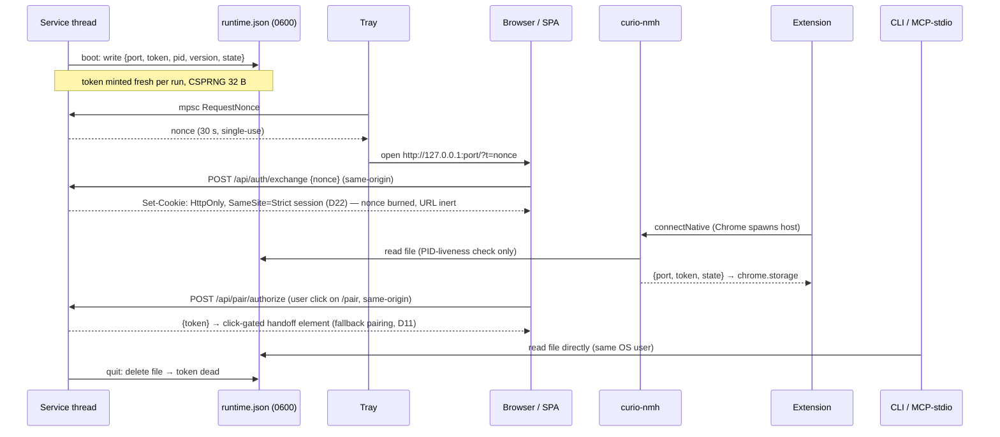

> TL;DR: Curio only listens on your own machine — but web pages in your browser also run on your machine, so "local" is not the same as "trusted". Every request must therefore prove itself with one secret token — carried as a bearer header or as the session cookie minted at dashboard launch — that is handed out over exactly four controlled paths, and every route checks who is asking (Host/Origin) before checking what they want. Screenshots and project files are served from locked "jails" so nothing outside them can leak, and the API key lives in the OS keychain, never in the database or logs.

## At a glance

| Asset | Threat | Control |
|---|---|---|
| Whole API + MCP tools | DNS rebinding (evil site resolves to 127.0.0.1) | Host allowlist + Origin rules → 403 (R-SEC-6, R-SEC-7) |
| Whole API | Malicious local page calling loopback directly | Runtime bearer token on sensitive routes (R-SEC-2); `Sec-Fetch-Site` defence-in-depth (R-SEC-12) |
| Runtime token | Leakage into browser history, logs, DOM | Never in URLs — 30 s one-time nonce for dashboard launch (R-SEC-5); DOM only via the click-gated `/pair` handoff (R-SEC-4); redaction rule (R-SEC-15) |
| Data root (DB, secrets, lock) | Leaks through project static serving | `projectServeRefusal` + resolved-path jails (R-SEC-9) |
| Process lifetime | Paired client gaining a kill switch | Separate quit token, excluded from API CORS headers (R-SEC-8) |
| Anthropic API key | Disk/log exposure | OS keychain, AES-GCM file fallback, write-only API, masked display (R-SEC-10) |
| Everything MCP can touch | CVE-2026-42559-class rebinding → tool invocation | rmcp ≥ 1.4.0 + own Host/Origin middleware in front (R-SEC-7); read-only tools + paused gate (R-SEC-13) |

- One secret (the runtime token), four distribution paths: native-messaging host → extension; nonce exchange → session cookie → SPA (D22); direct file read → CLI / MCP-stdio proxy; click-gated `/pair` DOM handoff → unpacked/dev extension installs (fallback, D11).
- `GET /health` is deliberately open and deliberately boring (R-SEC-11).
- Threat actor model: remote web content and rebound DNS — **not** other local processes running as the same OS user (they can read `runtime.json` by design; that is the trust boundary).

## The contract

**Token model**

- R-SEC-1: The server MUST bind loopback only (`127.0.0.1`; never `0.0.0.0`).
- R-SEC-2: There is exactly ONE client secret: the runtime bearer token — 32 bytes from a CSPRNG, base64url — generated fresh at each service start and invalidated at quit; the token is **per-run** (D21). It is published only in `runtime.json` (atomic temp+rename, owner-only permissions, 0600-equivalent) and replaces the Bun app's pairing token everywhere (one token model). The token (as `Authorization: Bearer`) or the session cookie it mints (R-SEC-5) MUST authenticate **every** `/api/*` route — reads and SSE included — `/mcp`, and the user-content jails `/files/items/*` and `/p/:id/*` (they serve user content; the SPA fetches them same-origin, so the cookie rides along and `` tags keep working), per the middleware map in [ARCH-01](01-backend-architecture.md). `/ws` authenticates by first-message token ([ARCH-01](01-backend-architecture.md) R-BE-32). The only exempt surfaces are `GET /health`, `GET /`, static SPA assets, and the click-gated pair-authorize flow (R-SEC-3 path d) — the latter a same-origin browser POST protected by the Host/Origin checks (R-SEC-6/R-SEC-7), the `Sec-Fetch-Site` check (R-SEC-12), and the SPA's click gate instead of a credential. (`POST /api/auth/exchange` authenticates by its single-use nonce.)
- R-SEC-3: The token MUST reach clients only via **four sanctioned paths**: (a) the native-messaging host reply `{port, token, state}` to the pinned extension; (b) the nonce exchange, which sets the SPA's HttpOnly, `SameSite=Strict`, session-scoped cookie (R-SEC-5, D22); (c) same-user file read of `runtime.json` by the CLI and the MCP-stdio proxy (D24); (d) the click-gated `/pair` DOM handoff backed by `POST /api/pair/authorize` — the sanctioned fallback pairing path for unpacked/dev extension installs (D11; [ARCH-01](01-backend-architecture.md) R-BE-9). No fifth path.
- R-SEC-4: The token MUST NOT appear in: URLs or query strings, browser history, `config.json`, the database, sidecars, logs, error messages, or MCP tool output — and never in the DOM at rest. The single DOM exception is path (d): on the `/pair` page the SPA writes the current per-run runtime token into the known handoff element **only after an explicit user click** — never present in the DOM before the click — and the extension-side reader keeps the Bun-era gates: exact path check, fixed element id, ≤ 512 chars, printable ASCII only (Inventory §6, §10.21).
- R-SEC-5: **Dashboard launch nonce → session cookie.** The tray (or an authenticated caller via `POST /api/auth/nonce`) obtains a single-use nonce with a 30 s TTL; the browser opens `/?t=<nonce>`; the SPA exchanges it via same-origin `POST /api/auth/exchange`, which sets the **HttpOnly, `SameSite=Strict`, session-scoped cookie** that authenticates all subsequent browser requests, SSE included (D22 — `EventSource` cannot send headers; the bearer header is equally accepted from non-browser clients). A nonce MUST be consumed atomically (second use → 401), MUST expire server-side, and grants nothing but the exchange. After exchange the URL in history is inert.

**Request validation**

- R-SEC-6: Host validation: requests to token-bearing routes MUST carry a Host whose host part is `localhost`, `127.0.0.1`, or `::1`; anything else → 403. This kills DNS rebinding, where `evil.example` resolves to 127.0.0.1 but the browser still sends `Host: evil.example`.
- R-SEC-7: Origin validation (all of `/api/*`, `/health` CORS, `/mcp`): allowed origins are exactly (a) empty/absent Origin (non-CORS callers: curl, MCP clients, same-origin fetch), (b) the pinned extension origin `chrome-extension://<id-derived-from-manifest-key>` (Inventory §10.1 — one fact in two files), (c) a loopback origin whose authority EQUALS the request's own Host — never a configured or remembered port (Inventory §10.2, the loopback-Host-echo rule). Anything else → 403. Because rmcp validates Host but NOT Origin (rust-sdk #822, the residual gap after CVE-2026-42559), this middleware MUST sit in front of the rmcp service — rmcp's own check is the second layer, not the first. rmcp floor ≥ 1.4.0 is mandatory.
- R-SEC-8: **Quit-token separation.** `POST /api/system/quit` authenticates ONLY with the quit token minted into the lock file at boot (32 bytes hex, 0600). The quit-token header MUST NEVER appear in any CORS `Access-Control-Allow-Headers` list for `/api/*` (a paired or token-holding client must not gain a kill switch — Inventory §10.3). Comparison MUST be timing-safe. Quit token ≠ runtime token, different files, different lifetimes.
- R-SEC-9: **Serve jails.** `/files/items/:id/:file` and `/p/:id/*` MUST resolve the target path and verify it stays inside the item directory / project directory respectively (reject traversal on the RESOLVED path, not the raw string). `/p/*` additionally applies `projectServeRefusal`: dotfiles, and the reserved data-root names — lock file, `library.db` prefix (incl. `-wal`/`-shm`), `config.json`, `.secrets.json`, `runtime.json` (defensive addition; it lives outside the data root), `skills/`, `items/`, `prompts/` — case-folded on Windows, judged on the resolved target (Inventory §10.4; leak precedent: quit token exfiltrated via `/p/<id>/curio.lock`). Directory listings MUST pass the same filter.
- R-SEC-10: **Secrets.** The Anthropic API key is stored keychain-first: DPAPI (Windows; secret passed via env, never argv) or macOS Keychain; fallback is an AES-256-GCM encrypted file (scrypt key derived from `curio:<hostname>:<username>`, 0600). The settings API is write-only for the key (`apiKey` accepted on PUT, never returned); reads expose only `apiKeySet` + masked `sk-ant-…xxxx`. The key MUST never enter the DB, sidecars, logs, or `runtime.json` (Inventory §5). Any public-settings projection MUST strip secrets structurally, not by schema omission alone — the Bun app's spread bug (Inventory §10.5) is the precedent.
- R-SEC-11: `/health` MAY be unauthenticated and cross-origin-readable — this is a contract, not an oversight: the extension's status dot and stale-instance probing need it pre-auth (Inventory §10.29). It MUST expose exactly `{status, version, port, items, queue, api_key_configured}` and nothing more: no paths, no tokens, no OS/user info. `port` merely echoes what the caller already used to connect; `api_key_configured` is a boolean, not a prefix.
- R-SEC-12: `Sec-Fetch-Site` defence-in-depth: on token-bearing routes, requests carrying `Sec-Fetch-Site: cross-site` SHOULD be rejected 403. This is a supplementary check — absence of the header MUST NOT cause rejection (non-browser clients don't send it).

**Blast radius**

- R-SEC-13: **MCP blast radius.** The lesson of CVE-2026-42559 (CVSS 8.8, CWE-346/350; the same class hit the TS/Python/Go/Java SDKs) is that a local MCP server's exposure equals whatever its tools can do. Therefore: query tools (`library_search`, `library_get_item`, `library_list_vocabulary`, `prompt_get`) are read-only by construction; mutating tools (`library_create_item`, `library_update_item`, `project_register`) MUST pass the same soft-disable gate as capture — paused means paused for MCP writes too. Tool surface details: [ARCH-05](05-mcp-architecture.md). No tool may return the runtime token, quit token, API key, or `runtime.json` contents.
- R-SEC-14: The stdio proxy (`curio --mcp-stdio`) reads `runtime.json` from disk as a same-user process and forwards to the live instance's `/mcp`; it never opens the database, and with no live instance it returns a clean JSON-RPC error (D24). It IS gated by `mcpEnabled`: forwarding into the gated `/mcp` means a disabled toggle yields the same 503 JSON-RPC, passed through unchanged ([ARCH-05](05-mcp-architecture.md) R-MCP-6; supersedes the old always-on stdio — ARCH-08 break #11). The OS user boundary remains its access control, matching the actor model above.
- R-SEC-15: **Redaction.** Log lines, panics, and error responses MUST NOT contain the runtime token, nonces, quit token, or API key. Middleware failures log the offending Host/Origin values (needed for diagnosis) but never credentials.
- R-SEC-16: Every contribution touching `curio-server` middleware, `/p` or `/files` serving, `runtime.json`, `curio-nmh`, or MCP tools MUST complete the review checklist in Design detail §"Review checklist" in the PR description.
- R-SEC-17: **Client token lifecycle.** Every client class MUST acquire, carry, and recover its credential exactly as the table in Design detail §"Client token lifecycle" prescribes (D21–D24): a 401 always means "the app restarted — re-bootstrap", never a user-facing failure.

## Design detail

### Threat model, in plain language

The app is a web server on your own machine. Four kinds of attacker matter:

1. **A rebound DNS name.** A malicious site's domain resolves to 127.0.0.1; the victim's browser happily sends requests to your loopback server with the attacker's page as the driver. Host validation (R-SEC-6) breaks this because the Host header still names the attacker's domain. This is not hypothetical: rmcp < 1.4.0 shipped exactly this hole (CVE-2026-42559), and the fix still leaves Origin unchecked — hence our own middleware in front (R-SEC-7).
2. **Any web page you visit.** Same-machine pages can attempt `fetch("http://127.0.0.1:<port>/…")` directly. Origin rules reject browser cross-origin calls, and the bearer token stops everything the page cannot name. Chrome's Local Network Access prompts add friction, but we do not rely on them.
3. **Whoever reads your history, logs, or served files.** Tokens in URLs outlive the request — hence the nonce (R-SEC-5). Secrets on disk near served roots leak through static serving — hence the jails (R-SEC-9), with the Bun-era quit-token leak as the cautionary tale.
4. **An over-capable MCP tool.** If validation ever fails, the damage is what tools can do — so tools are least-privilege and pause-gated (R-SEC-13).

Explicitly OUT of scope: other processes of the same OS user (they can read `runtime.json`; that is the design's trust boundary), physical access, and a compromised browser or extension store.

### Token flow

Four paths, one secret, and every path ends in a consumer that re-bootstraps on reconnect — which is why per-run token rotation (D21) costs nothing and why a stale token self-heals: the file or session it came from is gone or rewritten.

| Distribution path | Consumer | Trust anchor | Failure mode & recovery |
|---|---|---|---|
| NMH reply | Extension | Chrome only spawns the registered host for the pinned extension id | Stale token → 401 → extension re-runs `connectNative` |
| Nonce exchange → session cookie | SPA | Nonce reachable only via tray/authed caller; same-origin POST; cookie HttpOnly | Expired/used nonce or no session → SPA shows "Open Curio from the tray" |
| File read | CLI, MCP-stdio proxy | OS file permissions (owner-only) | File absent → "curio isn't running" message |
| `/pair` DOM handoff (fallback, D11) | Unpacked/dev extension | Same-origin + `Sec-Fetch-Site` + explicit user click; extension-side path/id/length/charset gates (R-SEC-4) | Stale token → 401 → user repeats the pairing click |

### Client token lifecycle (R-SEC-17)

| Client | Acquire | Carry | On app restart (401) | On expiry / no session |
|---|---|---|---|---|
| SPA | Tray nonce → `POST /api/auth/exchange` → HttpOnly `SameSite=Strict` session cookie (D22) | Cookie, sent automatically on every same-origin request incl. SSE | Static "Open Curio from the tray" screen that retries `GET /health`; never an error page | Same screen — a fresh tray launch mints a fresh nonce |
| Extension | NM handshake: `connectNative` → `{port, token, state}` (D23) | Token from `chrome.storage`, sent as the first `/ws` message and as bearer header on HTTP | Silent re-handshake once; if that also fails, surface the "reconnecting" state | Same — the NMH reply is the source of truth on every reconnect |
| stdio proxy / CLI | Read `runtime.json` (same-user file, D24) | Bearer header; the file is re-read per request | Re-read picks up the new token automatically | File absent / pid dead → clean "Curio isn't running" JSON-RPC error |

### Nonce mechanics

A nonce is a second CSPRNG value (32 bytes, base64url) held only in service-thread memory with `{created_at, used}`. Rules:

- TTL 30 s from mint; expiry is checked server-side at exchange, not client-side.
- Single use: the exchange marks it consumed atomically before responding; a replay races to a 401, never to a second token handout.
- At most a small fixed number of outstanding nonces (mint evicts the oldest); Quit or Pause→Resume does not invalidate them early — the TTL is short enough.
- The nonce authorizes exactly one thing: `POST /api/auth/exchange`. It is not a session, not a token, and never accepted by any other route.

### Jail mechanics

Both static-serving jails follow the same three-step check, in order: (1) resolve the requested path against the jail root (symlinks and `..` collapsed) and reject if the result escapes the root; (2) for `/p/*`, apply `projectServeRefusal` to the RESOLVED name — dotfiles and the reserved-name list, case-folded on Windows only; (3) only then open the file. Judging the resolved target matters because the Bun-era leak (Inventory §10.4) proved a raw-string check passes while the resolved path lands on `curio.lock`. Directory listings run every entry through step (2) before rendering. The `/files` jail keeps its parity quirk: a missing thumbnail falls back to `screenshot.png` only when the requested filename contains "thumb" (Inventory §10.20).

### Middleware order

For any guarded route: **Host check → Origin check → (Sec-Fetch-Site) → soft-disable 503 (mutating routes only, D25) → credential (cookie / bearer / nonce / quit token) → handler.** Identity checks precede availability checks precede credentials, so a rebinding attempt learns nothing — not even paused-ness — while a legitimate paused client gets a clean 503 on writes without needing credentials refreshed. The full route-group wiring lives in [ARCH-01](01-backend-architecture.md) §"Middleware map"; rejections are always 403 (documented choice per the MCP spec's Origin requirement).

### Why /health stays open

The extension must render its green/gray status dot before it has any credentials, and boot-time stale-instance probing must distinguish "live server" from "dead port" (Inventory §8). Both need an unauthenticated endpoint. The mitigation is minimalism (R-SEC-11): the response tells a caller that *a* curio is running and roughly how busy — nothing that identifies the user, the data, or the secrets. Counts (`items`, `queue`) are the most that cross-origin readers learn, and the owner accepts that trade for parity (Inventory §10.29).

### Review checklist (R-SEC-16)

1. Does any new route bypass the middleware order above? (It must not.)
2. Does any response, log line, or error string include a token, nonce, or key? Grep for the config/runtime field names.
3. Does any new file land inside `dataRoot` or a project dir? Add it to `projectServeRefusal` and the jail tests.
4. Do CORS `Access-Control-Allow-Headers` lists still exclude the quit-token header?
5. Is any URL constructed with a credential in it? Only `?t=<nonce>` is permitted.
6. New MCP tool: read-only? If mutating, is it behind the soft-disable gate? Does its output leak paths outside the data root's intended surface?
7. New settings field: does the public projection strip it structurally (allowlist, not omission)?
8. Any change to `runtime.json` writing: still atomic, still owner-only perms, still after migrations+bind?

## Parity obligations

- Inventory §1 (CORS/origin policy: allowed-origin trio, per-route allowHeaders), §10.1 (extension origin pinned to manifest key), §10.2 (Host-echo loopback rule, never configured port), §10.3 (quit-token separation + CORS exclusion), §10.4 (`projectServeRefusal`, resolved-target judging, win32 case-folding), §10.5 (structural stripping of secrets from public settings), §10.29 (/health openness + exact field list).
- Inventory §5 (secrets backends: DPAPI/keychain/AES-GCM file, env-not-argv, masking).
- FR-20 (extension status via open /health), FR-22 (clean not-running state — no token needed to know), FR-24 (client re-discovery, now via `runtime.json`), FR-27 (MCP off-switch isolation; the 503 JSON-RPC shape itself is [ARCH-05](05-mcp-architecture.md)'s).
- Deliberate parity BREAKS (owner-approved via strategy + D10/D11): the pairing token and the extension's port-walk are replaced by the runtime-token + NMH + nonce/cookie model; the `/pair` page, `POST /api/pair/authorize`, and the DOM handoff (Inventory §6, §10.21) survive as the click-gated **fallback** pairing path (D11) rather than the primary one, now handing off the per-run runtime token. [ARCH-08](08-parity-matrix.md) must list the replaced pieces as "superseded, not lost".

## Open questions

- OQ-1 (D0-verify; blocks: P1): confirm `Sec-Fetch-Site` is actually sent by current Chrome/Brave on loopback fetches from extension and SPA contexts — verify during D0, before P1 enforces R-SEC-12 as reject-on-cross-site.
- OQ-3 (D0-verify; blocks: P1): keychain integration crates (DPAPI + Security.framework) — pick and pin during D0; verify the scrypt-fallback parameters match the Bun implementation so an in-place upgrade can read the old `.secrets.json`.
- OQ-5 (D0-verify; blocks: P5): Chrome ~147 LNA gating of loopback WebSocket/fetch is secondary-sourced (Paper §12 item 9) — verify during D0 and re-verify before shipping the extension, since it could affect the extension's direct HTTP path even with valid tokens.
