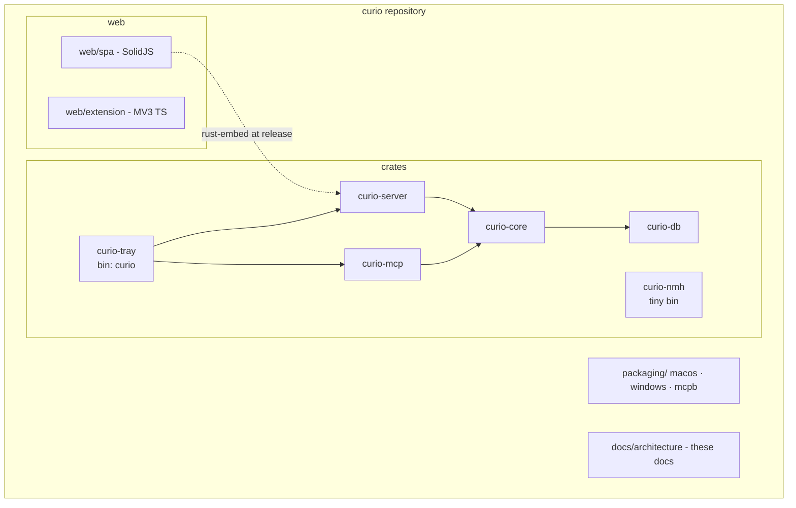
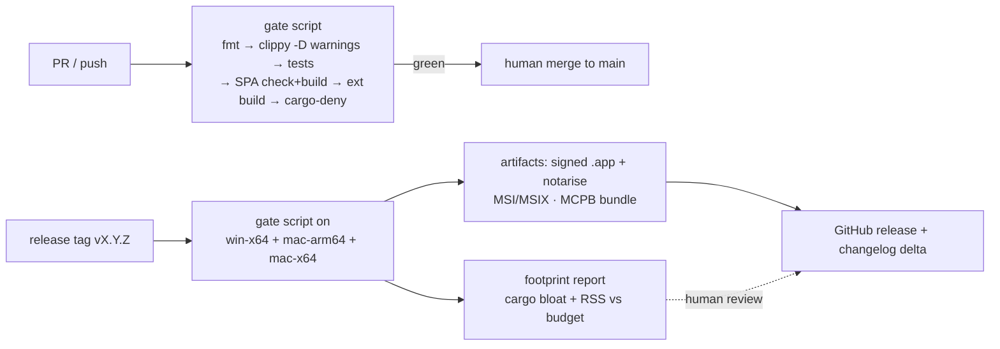

> TL;DR: curio ships as one cargo workspace with six crates, a SolidJS SPA and an MV3 extension, built by a single gate script that CI and developers both run. Releases are an NSIS installer for Windows and a universal `.dmg` for macOS plus an MCPB bundle, all stamped with one semver version, signed where a certificate exists and shipped unsigned with documented install steps where one does not (D34). The project is MIT-licensed and open-sourced with the standard hygiene set — contributing guide, private security disclosure, no telemetry, no secrets in the repo. The D0 verification spike is release-0: nothing else starts until its four claims are checked.

## At a glance



- **Dependency direction is law:** `curio-core` sees no SQL; `curio-db` is the only crate that sees SQL; server/mcp are thin over core; `curio-nmh` depends on nothing heavy.
- One gate script (`cargo xtask gate` or `just gate`) is the single definition of "green" — CI runs the same script, never a restated list.
- Version is stamped once and flows to the binary, `/health`, and `runtime.json`.
- License: **MIT** (owner decision, recorded in [ARCH-00](00-architecture-overview.md) register).
- D0 spike gates everything; the full D0-verify index — every such item across the doc set — lives in §Design detail (with a post-v1 vector-activation sub-group per D7 as amended).

## The contract

**Repository layout**

- **R-DEL-1** — The repo MUST use this layout; new top-level directories are a PR-review decision, not a convenience:
  ```
  crates/curio-core      # domain: items, vocabulary, prompts, projects, jobs, graph ops, embedder trait
  crates/curio-db        # rusqlite + sqlite-vec + migrations — the ONLY crate that sees SQL
  crates/curio-server    # axum router, middleware, SSE/WS, SPA embed, /mcp mount
  crates/curio-mcp       # rmcp tool router, thin over curio-core (ARCH-05)
  crates/curio-tray      # main.rs: native loop, tray menu, service thread — builds the `curio` binary
  crates/curio-nmh       # native-messaging host micro-binary
  crates/curio-runtime   # runtime.json shape — serde only, shared by server + nmh (D27)
  crates/xtask           # gate script + measurement tooling; dev-only, never shipped (D27)
  web/spa                # SolidJS + Vite + Tailwind 4
  web/extension          # MV3, plain TS
  packaging/macos  packaging/windows  packaging/mcpb
  docs/architecture      # ARCH-00..08 (these documents)
  ```
- **R-DEL-2** — Dependency directions (enforced by review and a CI check on `cargo tree`):
  - `curio-core` MUST NOT depend on rusqlite, axum, or rmcp. It defines traits (storage, embedder) that `curio-db` implements.
  - `curio-db` is the sole home of SQL, migrations, and sqlite-vec loading. No other crate may add a SQLite dependency.
  - `curio-server` and `curio-mcp` MUST stay thin: routing, transport, serialization — no business rules. Both call `curio-core` only.
  - `curio-nmh` MUST NOT depend on tokio, axum, or any crate in this workspace beyond a minimal shared types module; it reads `runtime.json`, replies, exits (strategy §7). Its compile output stays a tiny fast-spawning binary. That shared types module is `curio-runtime` (D27), which MUST stay serde-only: it owns the `runtime.json` shape so the file's format has one home (R-OV-2) rather than being duplicated into the host.
  - `xtask` is dev-only tooling. No shipped crate may depend on it, and it is excluded from the workspace's default members so `cargo build` does not compile it into a release path.

**Build system**

- **R-DEL-3** — Build = cargo + Vite, nothing else. In **release** builds the SPA's `dist/` is embedded via `rust-embed`; in **debug** builds the server proxies to the Vite dev server so frontend iteration never requires a Rust rebuild.
- **R-DEL-4** — Release profile (paper brief §1): `opt-level = "z"` or `"s"` (measure both in D0 and pin the winner), `lto = true`, `codegen-units = 1`, `panic = "abort"`, `strip = true`.
- **R-DEL-5** — Supported release targets: `x86_64-pc-windows-msvc`, `aarch64-apple-darwin`, `x86_64-apple-darwin`. All three MUST build in CI on every release tag; PR CI MAY build a subset for speed but the gate script must pass on at least one Windows and one macOS runner before merge to main.

**CI gates**

- **R-DEL-6** — **Single gate script.** One executable script in the repo is the only definition of the quality gate (principle carried over from the old repo's `scripts/gates.ts`). CI workflows MUST invoke that script and MUST NOT restate its steps. Its contents (order fixed, fail-fast):
  1. `cargo fmt --check`
  2. `cargo clippy --workspace -- -D warnings`
  3. `cargo test --workspace`
  4. SPA: typecheck + lint + production build
  5. Extension: typecheck + build
  6. `cargo-deny check licenses advisories` (license allowlist = MIT-compatible; advisories include the rmcp ≥ 1.4.0 floor, [ARCH-05](05-mcp-architecture.md) R-MCP-14)
  7. File-length check: any **code** file > 650 lines fails; 500–650 lines passes only with a justification recorded in the PR. Ceiling raised from 500 and stylesheets removed from the check by D35 (2026-08-02) — the raise was expedient and is recorded as such; the stylesheet exemption is principled, because the rule measures control flow a reviewer must trace and a flat declaration list has none
  8. Dependency-direction check: R-DEL-2's rules asserted on `cargo tree` (e.g. only `curio-db` sees SQL)
- **R-DEL-7** — **Footprint budget as a tracked report, not a hard gate.** Release CI MUST produce and archive: binary size (`cargo bloat` summary), and — on runners where measurable — idle private RSS of the shell. Numbers are compared against the §8 strategy budget (≤ 25 MB RSS with tray; ≤ 12 MB empty shell from D0). Regressions block release by human decision, not by script, because CI runners measure memory noisily.

**Packaging & uninstall**

- **R-DEL-8** — macOS: `.app` bundle, `LSUIElement = true`, **signed and notarised when a Developer ID is available; ad-hoc signed and shipped with documented install steps when it is not** (D34, amended 2026-08-02). Apple gates both the certificate and the notarisation service behind a paid membership and offers no open-source exemption, so signing is a funding state, not an engineering one. The ad-hoc signature is not optional in either case: Apple Silicon refuses to execute an unsigned arm64 binary, and `lipo` strips the signatures of its inputs. "Start at Login" uses `SMAppService.mainApp.register()` — the app is its own login item, no helper agent.
- **R-DEL-8a** — Release CI MUST NOT fail for want of a signing credential. The signing and notarisation steps are conditional on their secrets being present; absent them the pipeline produces an unsigned artifact and says so in the release notes. A release pipeline that cannot run until someone has paid a vendor has encoded a billing relationship as a build dependency.
- **R-DEL-9** — Windows: **NSIS** (D34, chosen 2026-08-02 from the NSIS-or-MSI option D29 left open). Every write the installer makes is per-user — an HKCU value per browser, a Run key, a directory under `%LOCALAPPDATA%` — and MSI's per-machine default would ask for an elevation none of them needs. The installer MUST NOT reimplement registration: it invokes `curio-nmh --register`, which is already on disk and already owns that logic (R-EXT-20, R-OV-2). **MSIX is dropped** (D29, amended 2026-08-01). MSIX was the only format that sandboxed the two writes below, so removing it removes the question rather than answering it: neither NSIS nor MSI restricts an HKCU write. `#![windows_subsystem = "windows"]`; installer writes the native-messaging registry key (`HKCU\SOFTWARE\Google\Chrome\NativeMessagingHosts\<name>`) at install time. Autostart via Run key, toggled in-app.
- **R-DEL-10** — MCPB bundle: `packaging/mcpb` holds the `manifest.json`; release CI runs `mcpb pack` against the platform binary to produce the Claude Desktop one-click artifact ([ARCH-05](05-mcp-architecture.md) R-MCP-7).
- **R-DEL-11** — **Clean uninstall is a feature.** Uninstall MUST remove: the app bundle/exe, NM manifests (registry key on Windows, per-user manifest file on macOS), autostart registration, and `runtime.json`. User data (the data root: DB, screenshots, sidecars, prompts) MUST be left in place — deleting a library is the user's explicit act, never a side effect.

**Versioning & release**

- **R-DEL-12** — Semver, one source: the workspace version in the root `Cargo.toml`. That single value MUST be stamped into the binary (`--version`), the `/health` response, and `runtime.json` — three surfaces, one fact. A version mismatch between any two is a release-blocking bug.
- **R-DEL-13** — Changelog is generated from conventional-commit-style messages (`feat:`, `fix:`, `docs:` …); release notes for a tag are the changelog delta. Commits that don't parse get fixed at PR review, not post-hoc.

**Open-source posture**

- **R-DEL-14** — License: **MIT**, at repo root, year + owner. All dependencies MUST pass the cargo-deny license allowlist (R-DEL-6); copyleft additions require an owner decision in the ARCH-00 register.
- **R-DEL-15** — The repo MUST carry: `CONTRIBUTING.md` (build + gate script + PR expectations), `CODE_OF_CONDUCT.md`, issue templates (bug / feature / D0-claim-reverification), and `SECURITY.md` with a **private disclosure route** (security email, no public issues for vulnerabilities) — mandatory because this is a loopback daemon holding a bearer token and an API key; a disclosure mishap is a user-machine compromise, not a website defacement.
- **R-DEL-16** — **No telemetry.** The app makes no network calls except user-initiated AI API calls and the user's own browsing. `SECURITY.md`/README MUST state this plainly; adding any phone-home requires an owner decision and a major-version bump.
- **R-DEL-17** — Secrets hygiene: `.env*` and `.secrets.json` patterns in `.gitignore` from day one; no tokens, API keys, or PII ever in logs, fixtures, or committed files; CI SHOULD run a secret-scanning step. API keys at runtime live in the OS keychain/DPAPI path ([ARCH-06](06-security-architecture.md)), never in the repo or the vault.

**Doc governance**

- **R-DEL-18** — The ARCH-00..08 documents are **contract-level**: code review may cite their rule IDs, and changing a rule requires a PR that bumps the doc's `version`, adds a `supersedes` note in frontmatter when a doc is replaced wholesale, and links the motivating issue. The authoring template these documents follow ships in-repo as `docs/architecture/TEMPLATE.md`; new or amended docs MUST conform to it. Docs and code MUST NOT diverge silently — a PR that violates a rule either changes the code or changes the doc, in the same PR.
- **R-DEL-19** — Future decisions use an **ADR-lite process**: no separate ADR directory; each decision is a new row in [ARCH-00](00-architecture-overview.md)'s decision register (ID, decision, rationale, reversal trigger), added by PR. A decision big enough to need pages gets its own doc appended to this set with the next ARCH-NN id.

**Release 0**

- **R-DEL-20** — The **D0 verification spike is a release milestone** (release-0) with its own tag and report. No Phase-1 work merges to main until every checklist item below has a recorded result (pass, or fallback chosen).

**Phase plan (normative, D26 — supersedes strategy §9's illustration)**

- **R-DEL-21** — Delivery follows this phase table. Exit criteria are parity-aware and binding: a phase is not done until its exits hold. Per D7 as amended (2026-07-31), the vector + graph layer is deferred post-v1: no vector/graph exit criteria appear below, and the vector-activation release re-runs its own D0 for the deferred items (see the post-v1 sub-group in §Design detail's D0 index). Epics spanning server + UI land their server semantics in P2 and their UI in P3; the phase table's FR column names the phase where the FR *completes*.

| Phase | Scope | Exit criteria | FRs | Owning docs |
|---|---|---|---|---|
| D0 | Verification spike (release-0) | Every §Design detail index item recorded pass-or-fallback (R-DEL-20) | — | all |
| P1 | Shell + server + auth: tray, boot/shutdown, runtime token, session cookie, `/ws`, `/pair` fallback | Two instances can't both run; stale `runtime.json` reclaimed; paused flips 503-for-writes | FR-23..25 | [ARCH-01](01-backend-architecture.md), [ARCH-06](06-security-architecture.md) |
| P2 | Data layer: FTS5, core services + jobs + watcher (existing chain ending at v4; vec0/graph deferred post-v1 per D7) | Existing `library.db` opens losslessly and round-trips on the existing chain | FR-1, 4–6, 9–11, 17–19, 26 | [ARCH-02](02-data-architecture.md), [ARCH-01](01-backend-architecture.md) |
| P3 | SolidJS SPA | Dashboard opens from tray with no token in the URL; reload survives; no-session screen works | FR-3, 7–8, 12–16 | [ARCH-03](03-frontend-architecture.md) |
| P4 | MCP | 7 parity tools pass MCP Inspector; paused refuses writes only; stdio proxy works via Claude Desktop config | FR-27 | [ARCH-05](05-mcp-architecture.md) |
| P5 | Extension + NMH | Capture survives worker termination per [ARCH-04](04-extension-architecture.md)'s watchdog rule (R-EXT-15a); NM bootstrap and `/pair` fallback both pair successfully | FR-2, 20–22 | [ARCH-04](04-extension-architecture.md) |
| P6 | Packaging | One-click installs incl. MCPB; clean uninstall removes NM manifests, registry keys, `runtime.json` | FR-23 (installers) | [ARCH-07](07-delivery-open-source.md) (this) |
| P7 | Budget pass | [ARCH-01](01-backend-architecture.md) budget table measured and recorded — or consciously revised, never silently missed | — | [ARCH-01](01-backend-architecture.md), [ARCH-07](07-delivery-open-source.md) |

## Design detail

### CI pipeline



Two invocations, one script: the PR path runs the gate; the tag path runs the same gate on all three targets, then packaging and the footprint report. There is deliberately no separate "CI checklist" document — R-DEL-6 makes the script the specification.

### Why the dependency rules are strict

The layering exists to keep three seams cuttable later (strategy §2, §7): the mpsc seam between tray and service (a future two-process split), the storage trait seam in `curio-core` (a future storage change without touching domain logic), and the `curio-nmh` isolation (Chrome spawns it per-connection; any heavyweight dependency is user-visible popup latency and a stdout-purity risk). A `cargo tree`-based CI assertion is cheap; unwinding an accidental `rusqlite` import from `curio-core` six months in is not.

### Dev loop

`cargo run` (debug) starts tray + server with the Vite proxy; `vite dev` runs beside it. The extension builds with the same TS toolchain into `web/extension/dist` for load-unpacked. Nothing in the dev loop requires signing, packaging, or network access beyond crates.io/npm installs — a fresh clone reaches a running app with two commands, and `CONTRIBUTING.md` states them.

### D0 verification-spike index (release-0) — every D0-verify item in the doc set

| Item | Owning doc / OQ | Fallback if it fails | Blocks |
|---|---|---|---|
| **Tray crates** (`tray-icon` + tao/winit): icon, menu, glyph swap; main-thread rules hold. **Windows gates release-0; macOS is retroactive** (D30) | [ARCH-01](01-backend-architecture.md) OQ-4 | alternative tray crate; worst case revisit strategy A1 | D0→P1 (Windows) |
| **Empty-shell RSS ≤ 12 MB** private (tray + axum + SQLite open, no data): `footprint` (macOS) / Private Working Set (Windows) | [ARCH-01](01-backend-architecture.md) OQ-4, R-BE-31 | budget consciously revised (D17, ARCH-00 register) — never silently | D0→P1, P7 |
| **TipTap core sans React**: chip node views + slash menu mount under Solid's lifecycle | [ARCH-03](03-frontend-architecture.md) OQ-2 | raw ProseMirror | P3 |
| **Keychain crates** (DPAPI + Security.framework). ~~scrypt fallback params~~ — the fallback is retired (D31) | [ARCH-06](06-security-architecture.md) OQ-3 | honest refusal + `ANTHROPIC_API_KEY` | P1 |
| **EcoQoS** via `SetThreadInformation` on the service thread (Win 11 ControlMask/StateMask gotcha) | [ARCH-01](01-backend-architecture.md) OQ-5 | ship without EcoQoS (default QoS) | P1 |
| **Sec-Fetch-Site** actually sent on loopback fetches from extension + SPA contexts | [ARCH-06](06-security-architecture.md) OQ-1 | keep R-SEC-12 advisory, don't enforce reject | P1 |
| ~~**rmcp pin**~~ — **moved out of release-0 (D28).** Major version is decided (3.x); the `StreamableHttpService` stateless/JSON question is verified at P4 against the code that calls it, because it cannot be answered before the MCP surface exists | [ARCH-05](05-mcp-architecture.md) OQ-1 | pin nearest verified minor ≥ 1.4.0 floor | **P4, not D0** |
| **NMH cold-start** on Windows (Defender first-run scan) keeps popup dot sub-second | [ARCH-04](04-extension-architecture.md) OQ-4 | cache last-known-good `{port, token}`, validate lazily | P5 |
| **Unpacked-extension `key`/id** behavior: same id unpacked as packed | [ARCH-04](04-extension-architecture.md) OQ-2 | legacy fallback ladder (R-EXT-8) | P5 |
| **`opt-level "z"` vs `"s"`**: measure size + hot-path speed, pin one | this doc, OQ-1 | pin `"s"` | P1 |
| ~~**MSI vs MSIX**~~ — **closed by D29.** MSIX is dropped; NSIS or MSI (or both) sandbox neither the NM registry write nor the Run key, so the question no longer exists | this doc, OQ-2 | — | closed |
| **MCPB tooling**: `mcpb pack` CLI shape + binary-server manifest fields | this doc, OQ-3; [ARCH-05](05-mcp-architecture.md) OQ-3 | ship documented `claude_desktop_config.json` snippet until tooling verified | P6 |
| **Chrome ~147 LNA-WS gating** of loopback WebSockets (secondary-sourced) | [ARCH-04](04-extension-architecture.md) OQ-1; [ARCH-06](06-security-architecture.md) OQ-5 | extension contingency per [ARCH-04](04-extension-architecture.md) | P5 |

**Post-v1 (vector activation) sub-group** — deferred per D7 as amended (2026-07-31); these items are verified in the vector-activation release's own D0, not release-0:

| Item | Owning doc / OQ | Fallback if it fails | Blocks |
|---|---|---|---|
| **sqlite-vec**: pin exact version; loads into bundled rusqlite on all targets; KNN correct on seeded data | [ARCH-02](02-data-architecture.md) OQ-1 | SQLite Vec1, else FTS5-only-defer (D8); semantic tools withheld per [ARCH-05](05-mcp-architecture.md) R-MCP-2 | vector-activation release |
| **Embedder choice** (remote API, dimension, cost per item) | [ARCH-02](02-data-architecture.md) OQ-2 | embedding jobs queue unconfigured (R-DA-13) | vector-activation (v5) migration |

The spike's output is a short report committed under `docs/architecture/` and referenced from the ARCH-00 register — the same epistemic rule the Paper applies to itself: budgets and pins are claims until measured.

## Parity obligations

- **FR-23** — double-clickable packaged executable per platform with tray icon (R-DEL-8, R-DEL-9; tray behavior itself: [ARCH-01](01-backend-architecture.md)).
- **PRD §12 M5** — packaging milestone: installers, tray, both OSes (R-DEL-5, R-DEL-8..R-DEL-11).
- **Inventory §5** — version surfaced in settings/health; secrets storage patterns (keychain/DPAPI/encrypted file) that R-DEL-17 must not regress; `.secrets.json` 0600.
- **Inventory §7** — extension manifest `key` pins the extension id; the packaging pipeline MUST carry that manifest through the extension build unchanged (Inventory §10.1 — one fact in two files).
- **Inventory §8** — NM host registration written at install time; clean shutdown/uninstall leaves no stale lock or `runtime.json`.
- **Inventory §10.29** — `/health` includes `version`: R-DEL-12's single stamped version is what makes that field trustworthy.

## Open questions

| # | Question | Tag |
|---|---|---|
| 1 | `opt-level "z"` vs `"s"`: measure binary size and hot-path speed in the D0 shell and pin one. | D0-verify, blocks: P1 |
| 2 | MSI vs MSIX for Windows: MSIX sandboxing may complicate the NM registry write and Run-key autostart — verify before P6; MSI is the safe default. | D0-verify, blocks: P6 |
| 3 | `mcpb pack` current CLI shape and binary-server manifest fields (format formerly `.dxt`). | D0-verify, blocks: P6 |
| 4 | ~~Gate-script host: `cargo xtask` vs `just` vs shell.~~ **Resolved 2026-07-31 (D27): `cargo xtask`**, invoked as `cargo gate` via a `.cargo/config.toml` alias. Neither runner nor contributor installs anything beyond the pinned toolchain, and R-DEL-6's steps 7 and 8 become Rust over `cargo metadata` rather than two shell scripts that drift per OS. | closed |
| 5 | Whether PR CI runs all three targets or one per OS family (R-DEL-5 allows a subset) — decide once real CI minutes are known. | owner: maintainer, blocks: P1 |
